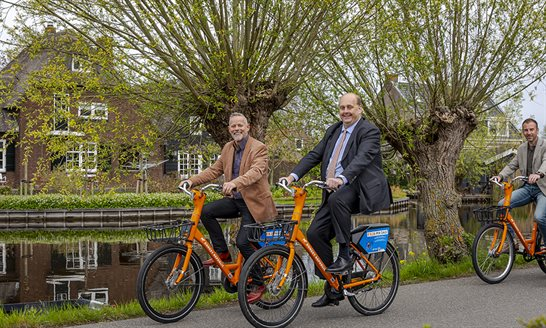

<em>Gepubliceerd op 17 april 2025</em>

Molenlanden is de 26ste Zuid-Hollandse 
gemeente waar de deelfietsen van Donkey Republic staan. Zo reis je 
simpel van deur tot deur met een combinatie van openbaar vervoer en 
fiets.

<h2>Aanvulling op andere vervoermiddelen</h2>

Provinciebestuurder Frederik Zevenbergen 
(verkeer en vervoer) en wethouder Maarten van Helden (bereikbaar en 
mobiliteit) namen op 17 april 100 deelfietsen in de gemeente Molenlanden
 in gebruik. Zevenbergen: "Deelfietsen zijn een belangrijke aanvulling 
op andere vervoermiddelen. Stap je uit de trein of bus, dan rijd je 
voortaan met een fiets van Donkey Republic naar je werk of school. De 
provincie investeert graag in slimme deelmobiliteit en is daarom blij 
met deze samenwerking."

<h2>Vrijheid om te reizen</h2>

Donkey Republic biedt veel vrijheid om te 
reizen. Via de app van Donkey Republic zien gebruikers waar deelfietsen 
staan en waar de verzamelplekken zijn waar je je fiets kunt inleveren. 
Een voordeel is dat je de fiets op iedere verzamelplek weer mag 
achterlaten, en niet per se terug hoeft naar je opstapplek.

<h2>Deelfiets slaat aan</h2>

Deelfietsen slaan aan: de succesvolle 
OV-fiets bestaat al langer, en op de fietsen van Donkey Republic maakten
 Zuid-Hollanders 650.000 ritten alleen al in 2024. Sinds vorige week 
staan de Donkey-fietsen ook in Alphen aan den Rijn, waardoor ze nu samen
 met Molenlanden in 26 Zuid-Hollandse gemeenten staan. Donkey Republic 
gaat het aanbod de komende jaren in samenwerking met de provincie en 
gemeenten verder ontwikkelen.

<h2>Aanvulling op het vervoer</h2>

De deelfietsen in Molenlanden zijn een mooie 
aanvulling op de deelfietsen die in 2023 beschikbaar kwamen in de regio 
en op de stations van de MerwedeLingelijn. Van Helden: "Deelfietsen zijn
 een moderne en innovatieve oplossing die het mogelijk maakt om na een 
reis met het openbaar vervoer de laatste afstand naar een van onze 
dorpen of stad de fiets te pakken. We zijn erg blij dat de provincie en 
vervoermaatschappij Qbuzz hiermee willen bijdragen aan de bereikbaarheid
 van onze mooie gemeente."

<h2>Combinatie OV en deelfiets biedt reizigers een alternatief</h2>

Rich Singh, manager reizen van Qbuzz, vult 
aan: "We bewegen steeds meer naar het bieden van mobiliteitsoplossingen.
 De deelfiets sluit in onze ogen mooi aan op het OV. Waar voorheen de 
auto werd gebruikt voor de hele rit, biedt de combinatie OV en deelfiets
 nu een alternatief. En daarmee verrijken we de mogelijkheden van onze 
reizigers."

<figure class="wp-block-media-text__media"></figure>

<h2>Meer informatie</h2>

<ul>
<li><a href="https://www.Zuid-Holland.nl/onderwerpen/verkeer-vervoer/openbaar-vervoer/">Openbaar vervoer in Zuid-Holland</a></li>
<li><a href="https://social.overheid.nl/@Zuid_Holland" target="_blank" rel="noopener">Volg ons op Mastodon</a></li>
<li><a href="https://bsky.app/profile/Zuid-Holland.bsky.social" target="_blank" rel="noopener">Volg ons op Bluesky</a></li>
<li><a href="https://www.threads.net/@mooiZuidHolland" target="_blank" rel="noopener">Volg ons op Threads</a></li>
<li><a href="https://www.twitter.com/Zuid_Holland" target="_blank" rel="noopener">Volg ons op X</a></li>
</ul>

