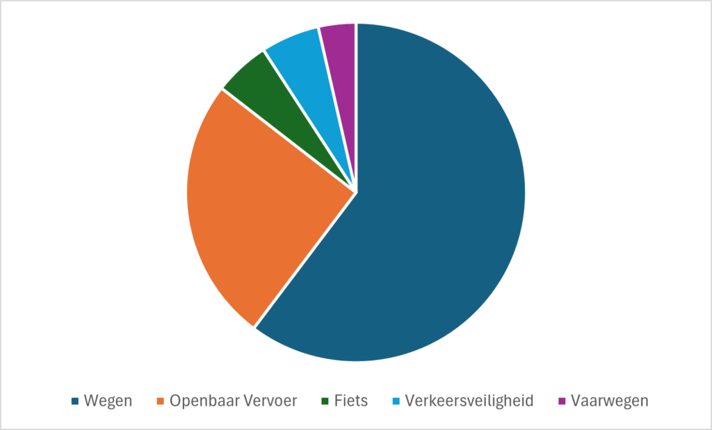
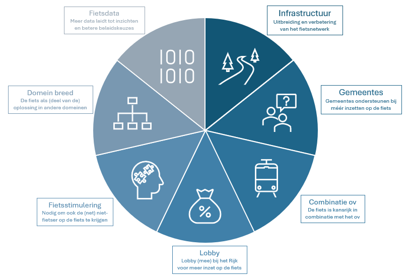

Hoe mooi kan Zuid-Holland worden als we de komende tien jaar flink meer gaan fietsen? En welke maatregelen kunnen we dan nemen? Dat zijn de vragen van deze snelstudie, een compact onderzoek binnen het onderzoeksplatform <a href="https://web.archive.org/web/20251218195519/https://kennis.zuidholland.nl/">Kennis Zuid-Holland</a> ter inspiratie. Eerder schreven we <a href="https://web.archive.org/web/20251218195519/https://kennis.zuidholland.nl/kansen-voor-mobiliteit/">Acht kansen voor mobiliteit</a> met ook daarin een pleidooi voor lopen en fietsen.

Fietsen doen we in Nederland al twee eeuwen. Dat is niet zonder reden: het is een leuke, gezonde en goedkope manier van verplaatsen. Daarnaast is fietsen duurzaam en ruimte-efficiënt, wat Zuid-Holland goed van pas komt bij de uitdagingen waar we voor staan. Fietsen biedt dus veel voordelen, zowel voor de fietser zelf als voor de hele samenleving. Daarom doet de provincie Zuid-Holland de oproep: 'Ga gewoon fietsen'.

Stel je eens voor dat we <a href="https://www.zuidholland.nl/onderwerpen/ruimte/ruimte/ruimtelijke-koers/" target="_blank" rel="noreferrer noopener">onze ruimtelijke puzzel</a> zó leggen dat veel woningen, werklocaties en voorzieningen binnen een kwartiertje fietsen (of lopen) te bereiken zijn. Niet alleen in stedelijk gebied, maar ook daarbuiten. Door de komst van de e-bike is dat steeds haalbaarder. Zo pakken steeds meer mensen de fiets en kunnen mensen (en goederen) die wél op de (vracht)auto zijn aangewezen, met minder files doorrijden naar hun bestemming.

Stel je eens voor dat we voor de komende jaren een ambitieus 'Fietsplan 2025–2035' opstellen, waarmee we streven naar flink meer fietskilometers in 2040. We vertalen hiermee de landelijke ambities (40% meer) in het 'Nationaal Toekomstbeeld Fiets' naar provinciale doelen. Dat zou onze provincie veel goeds brengen. Om dat te realiseren moet er natuurlijk wel een tandje bij en is bovendien ook meer geld nodig.

<strong>Hoogwaardig openbaar vervoer &amp; overal een fiets</strong> 
In en tussen woonplaatsen zorgen we voor hoogwaardig openbaar vervoer: betrouwbare, comfortabele, frequente en snelle bussen, trams, metro's en treinen. Als je uitstapt, staat er een <a href="deelfiets.html" target="_blank" rel="noreferrer noopener">deelfiets</a> voor je klaar. Zo blijft fietsen niet beperkt tot een cirkel rond je huis, maar 'heb' je overal een fiets. Lees ook de snelstudie <a href="treinfietscombi.html" target="_blank" rel="noreferrer noopener">Meer treingebruik bij verbeterd deelfietsaanbod</a>.

<strong>Mooier Zuid-Holland</strong> 
Als meer mensen gaan fietsen, is er minder ruimte nodig voor auto's. Dat komt goed uit, want in het dichtbevolkte Zuid-Holland is de ruimte schaars. Ook andere voordelen van (vaker en verder) fietsen, dragen bij aan een mooier Zuid-Holland, zowel voor het individu als de samenleving.

<h2>1. De voordelen van fietsen</h2>

Zeven voordelen voor de fietser: <em>(Alle ▶ kun je uitklappen door te klikken)</em>

1 Fietsen kan sneller zijn (tot 5 km)

Op een afstand tot 5 kilometer kan de fiets sneller zijn dan de auto. Zeker als je als automobilist moet zoeken naar een parkeerplek. Een e-bike kan 25 kilometer per uur en vergroot de actieradius van fietsers: tot zo'n 15 kilometer. Steeds meer gemeenten verlagen de maximumsnelheid binnen hun bebouwde kom naar 30 km/u. Dan zijn de reissnelheden van fiets en auto al bijna hetzelfde. De fiets staat bij vertrek voor je deur of in je berging of schuurtje en je fiets kun je bij aankomst ook vaak voor de deur (van school, sportvelden, station, theater, werk, winkelcentrum) parkeren. Ook zijn er voor fietsers vaak doorsteekjes, fietspaden en rechtstreekse routes die auto's niet mogen gebruiken. Dat alles betekent dat de fiets binnen de bebouwde kom nu al vaak sneller is dan de auto.

2 Fietsen is voordelig

<strong>Het kopen van een fiets is een kleine investering in vergelijking met een auto. Daarna is fietsen zo goed als gratis en krijg je zelfs geld toe als je van en naar werk reist.</strong>

De aanschafprijs van een nieuwe fiets is grofweg 25 keer zo laag als die van een nieuwe auto. Daarnaast liggen de onderhoudskosten van een fiets ook veel lager, zeker voor klein onderhoud dat je zelf kunt doen. Ook het gebruik van een fiets is voordelig; een fiets verbruikt geen brandstof en zelfs de kosten van het opladen van een e-bike zijn per kilometer vele malen lager dan de energiekosten van een auto.

Hier komt nog bij dat een werkgever 0,23 euro per kilometer aan reiskosten mag vergoeden. Het maakt hierbij niet uit voor welk vervoermiddel. Omdat fietsen per kilometer goedkoper is dan autorijden, kan deze reiskostenvergoeding voor fietsers voordeel opleveren. Ook hebben veel werkgevers tegenwoordig een fietsplan, waardoor werknemers fiscaal vriendelijk een 'fiets van de baas' kunnen aanschaffen. Dit verlaagt de fietskosten verder.

3 Fietsen is gezond

Fietsen vergroot je fysieke gezondheid. Dat is niet alleen een voordeel voor jezelf, maar ook voor de hele maatschappij. Mensen die actief naar en van hun werk reizen (lopen of fietsen), hebben 8 procent lager algemeen overlijdensrisico, 9 procent lagere kans op hart- en vaatziekten en 30 procent lagere kans op diabetes. Actieve mobiliteit, alleen al voor woon-werkverkeer, draagt dus bij aan de individuele gezondheid. Ook heeft fietsen een positief effect op de <em>ervaren</em> gezondheid. Wanneer iemand meer kilometers gaat afleggen met de fiets, stijgt de ervaren gezondheid. Dit effect zie je pas als de afstand per rit (ook) toeneemt: van tweemaal per week één kilometer fietsen naar driemaal per week twee kilometer fietsen, zorgt ervoor dat mensen hun gezondheid als beter ervaren. Wie fietst blijft ook langer gezond (bron: <a href="https://www.pbl.nl/publicaties/fietsen-leidt-tot-langer-en-gezond-leven">Fietsen leidt tot langer en gezonder leven (Planbureau voor de Leefomgeving)</a>).

4 Fietsen vermindert stress

Bewegen is ook goed voor je ervaren gezondheid én <a href="https://web.archive.org/web/20251218195519/https://www.fietsersbond.nl/onderweg/fietsen-en-gezondheid/het-effect-van-fietsen-op-de-mentale-gezondheid/#:~:text=Regelmatig%20fietsen%20verlaagt%20de%20kans%20op%20psychische%20problemen&amp;text=Stress%3A%20Fietsen%20kan%20helpen%20je,kan%20je%20stress%20zelfs%20voorkomen.">mentale gezondheid</a>. Het risico op <a href="https://www.upckuleuven.be/nl/nieuws/bewegen-helpt-bij-ernstige-depressie">depressie</a> daalt sterk bij 30 minuten beweging per dag – twee fietsritten van 15 minuten zijn al genoeg. Ook zorgt activiteit voor minder kans op andere psychische klachten en stress, maar juist voor een beter geheugen en een goede nachtrust.

5 Fietser leeft langer

Door een uur te fietsen leef je gemiddeld een uur langer, ontdekte de <a href="https://www.uu.nl/nieuws/lang-leve-de-fietser">Universiteit van Utrecht</a> in 2015. Als je er zo naar kijkt, kost fietsen je helemaal geen tijd (zie <a href="https://decorrespondent.nl/12251/waarom-de-fiets-veel-sneller-is-dan-je-denkt-en-de-auto-veel-trager/de37a91b-0d5f-0f2e-349c-fc1ba5ad681a">De Correspondent</a>). Oftewel: de tijd die jij op de fiets zit naar de supermarkt, krijg je er gewoon weer bij. En niet pas als je oud en misschien krakkemikkig bent.

6 Fiets vergroot maatschappelijke deelname

<strong>Met de fiets ben je vrijer en vergroot je de omgeving die voor jou bereikbaar is.</strong>

Fietsen is belangrijk voor de ontwikkeling van kinderen; de (sociale) actieradius van een kind groeit mee met de afstand die zij kunnen fietsen. Zij leren gaandeweg de verkeersregels (van meefietsende ouders) en worden steeds zelfstandiger in het verkeer. Kinderen die voor hun verplaatsingen afhankelijk zijn van hun ouders (auto of ov), verkeren vaker in dezelfde omgeving. Dit geldt niet alleen voor kinderen, maar ook voor volwassenen die niet kunnen of mogen autorijden: fietsen is sociaal inclusief, omdat het hun actieradius vergroot (in vergelijking met lopen), waardoor meer voorzieningen binnen bereik komen. Het maakt hun mobiliteit dynamischer en onafhankelijker.

7 En het regent bijna nooit!

<strong>En dat het altijd regent in Nederland, is een slecht excuus!</strong>

Volgens de website <a href="https://www.hetregentbijnanooit.nl/site/">hetregentbijnanooit.nl</a> regent het in nog geen 10 procent van fietsritten van 45 minuten. In meer dan negen van tien ritten blijf je dus droog. Fiets je korter dan 45 minuten, dan blijf je dus nog vaker droog. Met app's als <a href="https://moopmoop.nl/" target="_blank" rel="noreferrer noopener">MoopMoop</a> kun je vaak ook 'om de buien heenrijden': op een andere route of tijd.

En acht voordelen voor de samenleving:

1 De fiets neemt minder ruimte in op de weg én fiets stallen kost minder ruimte dan auto parkeren

Het <a href="https://www.zuidholland.nl/onderwerpen/ruimte/ruimte/ruimtelijke-koers/" target="_blank" rel="noreferrer noopener">Ruimtelijk Voorstel van de provincie Zuid-Holland</a> zet in op verdichting en functiemenging; wonen en werken worden zoveel mogelijk geconcentreerd in (hoog)stedelijke gebieden. Nabijheid is hier een sleutelbegrip voor de kwaliteit van leven; dit zorgt voor minder verplaatsingen over lange afstand. De fiets past uitstekend bij compacte steden. In combinatie met beter ov, waardoor je altijd dichtbij in (hoogwaardig) openbaar vervoer kunt stappen, verbetert de fiets de bereikbaarheid. Alles compact en dichtbij leidt wel tot een ander probleem: er blijft weinig ruimte over.

Verder neemt een gestalde fiets minstens vijf keer minder ruimte in beslag dan een geparkeerde auto. Simpel gezegd: fietsen kunnen ruimte besparen, die we hard nodig hebben voor andere voorzieningen.

2 Fiets brengt bestemmingen dichterbij

Als we wijken en kernen volgens het STOMP-principe inrichten (eerst actieve mobiliteit 'Stappen en Trappen', dan het collectieve ov en mobiliteitsdiensten en tot slot de Privé-auto), stimuleer je óók fietsgebruik. Er wordt al gesproken over Bike Oriented Development, stedelijke ontwikkeling waarin fietsbereikbaarheid centraal staat.

Het blijkt dat als mensen meer dan 2 kilometer van een station (of HOV-halte) werken, ze geneigd zijn voor de hele verplaatsing de auto te pakken in plaats van het ov. Deelfietsen stimuleren voor dit natransport (ook wel de 'last mile'), kan mensen aanzetten de auto te laten staan.

3 Fiets en ov gaan hand in hand (versterken elkaar)

Zo gaat circa 40% van de mensen met de fiets van huis naar het station (<a href="http://www.kimnet.nl/publicaties/publicaties/2023/11/28/fietsfeiten-2023">KIM rapport 2023</a>). Buslijnen met een hogere frequentie en snelheid, zoals R-net, trekken in het voortransport (first mile) grofweg twee keer zoveel fietsers (20 procent) als gewone buslijnen (10 procent). Het stimuleren van (deel)fietsen voor het natransport (last mile), leidt tot meer openbaar-vervoergebruik. De OV-fiets is een mooi voorbeeld van natransport voor treinreizigers.

Flexibele deelfiets systemen versterken ook het ov doordat de mensen bijvoorbeeld heen met de bus kunnen gaan en 's avonds als er nog maar weinig bussen rijden, de deelfiets (of scooter) pakken.

4 Meer fietsers maken verkeer veiliger

Hoe meer mensen fietsen, hoe groter de kans op ongevallen. In Zuid-Holland vallen er in vergelijking met andere provincies iets meer gewonden bij aanrijdingen tussen (brom)fietsers onderling. Dat kan duiden op smalle en/of volle fietspaden. Fietsen lijkt dus in eerste instantie negatief voor veilig verkeer. Maar hoe meer mensen fietsen, hoe beter.

(On)veiligheid is voor niet-fietsers een reden om de fiets te mijden, vooral als het gaat om fietsen met kinderen. Dit gaat niet alleen om fysieke veiligheid (ongevallen), maar ook om sociale veiligheid (gevoel van veiligheid). Ouders vinden het bijvoorbeeld niet altijd prettig om hun dochters in het donker van school naar huis te laten fietsen over rustige, slecht verlichte of afgelegen fietspaden. Het lijkt lastig om hier maatregelen voor te nemen, maar méér fietsers op dit soort routes kunnen zorgen voor meer sociale controle. Met betere en veiligere routes, ook in landelijke gebied, stimuleren we dus tegelijk een sociaal veilige fietscultuur. Daarnaast kunnen we zowel fysieke als sociale aspecten van het fietsen veiliger maken door het stimuleren van fietsvaardigheid. Een rijbewijs is een eis voor het besturen van een auto, maar iedereen mag fietsen. Daarom is het des te belangrijker dat iedereen ook op een verantwoordelijke manier leert fietsen: met kennis van verkeersregels, met zichtbare verlichting, met een goed onderhouden en veilige fiets én fatsoenlijk gedrag richting andere verkeersdeelnemers. Hoe meer mensen fietsen, hoe veiliger het verkeer wordt. Ook omdat fietsende automobilisten beter beseffen hoe kwetsbaar ze zijn ten opzichte van auto's.

5 Fiets is duurzaam

Fietsen is, samen met lopen, een van de duurzaamste vormen van mobiliteit. Een fiets verbruikt geen brandstof, is minder productie-intensief dan een auto en vergt minder groot onderhoud. De uitstoot van CO2 van fietsen ligt per kilometer 93 procent lager dan die van autorijden. Naarmate er meer mensen de fiets pakken in plaats van de auto, neemt de luchtvervuiling dus af. Hierdoor groeit het netto-effect op de gezondheid (een individueel voordeel) nog verder. Voor de gezondheid van de fietsers geldt hetzelfde als voor hun veiligheid: hoe meer mensen er gaan fietsen, hoe gezonder en veiliger het collectief is. Daarnaast is de fiets vrijwel geruisloos, in tegenstelling tot de auto, en zorgt de fiets dus voor minder geluidsoverlast. Dit is niet alleen prettig in drukke steden, maar juist ook in landelijk gebied.

6 Fiets is kostenefficiënt

Fietsvoorzieningen als fietspaden en fietsenstallingen zijn relatief snel te realiseren. Investeren in fietsinfrastructuur is ook goedkoper dan infra voor ov (busbanen) of auto (wegen). Elke gefietste kilometer genereert belangrijke maatschappelijke voordelen, terwijl elke kilometer met de auto eigenlijk een extra kostenpost creëert (elke fietskilometer levert de samenleving 18 cent op; elke autokilometer kóst de samenleving juist 11 cent). Door brede welvaart (alles wat mensen van waarde vinden) mee te nemen in de kosten-batenanalyses van investeringen in fietsvoorzieningen, wordt het economische voordeel duidelijker. Deze strategie heet '<a href="https://dutchcycling.nl/knowledge/blogs-by-experts/how-to-get-cycling-on-the-agenda-bikenomics/" target="_blank" rel="noreferrer noopener">Bikenomics</a>' en wordt steeds populairder bij beleidsmakers.

7 Fiets is goed voor economie

Ook voor de economie zelf is het voordelig als er meer gefietst wordt. <a href="https://fietsberaad.nl/Kennisbank/Fietser-koopt-half-zoveel-als-automobilist" target="_blank" rel="noreferrer noopener">Onderzoek</a> heeft uitgewezen dat een fietser per bezoek weliswaar minder koopt, maar vaker komt en in totaal anderhalf keer zoveel geld besteedt als een automobilist. Ook kan een bedrijventerrein, universiteit of winkelgebied goed bereikbaar blijven voor degenen die écht met de auto moeten, als meer mensen gaan fietsen.

8 Fiets is inclusief

<strong>Fietsen zorgt voor een betere maatschappelijke betrokkenheid en het is een laagdrempelige manier van vervoer.</strong>

Het breed stimuleren van de fiets kan zorgen voor een grotere maatschappelijke betrokkenheid. Niet alleen door het verbeteren van de bereikbaarheid van voorzieningen, maar ook door het verbeteren van gezondheid en leefomgeving. Fietsvriendelijke wijken zijn leefbaarder, mensgerichter en vergroten de aantrekkelijkheid van winkels. De fiets biedt mensen met lagere inkomens extra mogelijkheden om sociaal betrokken te blijven. Deze groep is nu vaak minder mobiel en verkeert in een beperktere omgeving. Dit zorgt ervoor dat zij minder activiteiten (kunnen) ondernemen. Zeker in gebieden en bij bevolkingsgroepen die laag scoren op brede welvaart kan dit leiden tot een toename in 'hangjongeren' en (jeugd)criminaliteit. De fiets biedt een kans om een grotere sociale kring op te bouwen, ongeacht afkomst of inkomen.

Daarnaast is de fiets laagdrempelig vervoer: bijna iedereen kan fietsen, zo nodig met gebruik van hulpmiddelen. Rolstoelfietsen, ligfietsen en elektrische fietsen zijn voorbeelden van aangepaste fietsen die de toegankelijkheid van de fiets vergroten. En hoe meer mensen die in staat zijn om te fietsen dat ook daadwerkelijk doen, hoe meer ruimte er in het ov en op wegen overblijft voor mensen die dat niet (altijd) kunnen.

<h2>2. Fietsen in cijfers</h2>

In Zuid-Holland gaat 9 procent van de kilometers per fiets

Nederlanders fietsen 18,2 miljard kilometer per jaar. Dat is 10 procent van de in totaal 185 miljard kilometer die we met z'n allen afleggen. Met bijna 18 miljoen inwoners fietst de gemiddelde Nederlander dus ruim 1.000 kilometer per jaar en 2,8 kilometer per dag. In Zuid-Holland liggen die getallen iets lager. Per dag fietst een Zuid-Hollander gemiddeld 2,5 kilometer. In een jaar legt ze zo'n 900 kilometer af per fiets van de in totaal 9800 kilometer. Zo'n 9 procent dus. Vooral in Rotterdam en Den Haag wordt verhoudingsgewijs minder gefietst. Hier valt dus winst te halen: langere fietsritten.

In Zuid-Holland wordt voor 26 procent van de verplaatsingen de fiets gebruikt

Van alle verplaatsingen gaat landelijk 28 procent op de fiets. Dat percentage fietsritten ligt hoger dan bij de fietskilometers, omdat fietsritten korter zijn dan ov- en autoritten. De gemiddelde lengte van een fietsrit bedraagt 4 kilometer. De gemiddelde busrit is 14 kilometer en de gemiddelde autorit 18 kilometer. De fiets is dus vooral sterk op korte afstanden. In Zuid-Holland wordt van alle verplaatsingen in 26% van de gevallen de fiets gebruikt, iets lager dan het landelijk gemiddelde. Hier valt dus winst te halen: meer fietsritten.

Fietsveiligheid: relatief veel slachtoffers

Van de 684 <a href="https://www.cbs.nl/nl-nl/visualisaties/verkeer-en-vervoer/verkeer/hoeveel-mensen-komen-om-in-het-verkeer-" target="_blank" rel="noreferrer noopener">verkeersdoden in Nederland in 2023</a> waren er 270 fietsers. Dat is een aandeel van 40 procent. Fietsers zijn dus oververtegenwoordigd als je ze afzet tegen hun aandeel ritten van 28 procent. In Zuid-Holland waren er in totaal 101 verkeersdoden in 2023. Het aandeel verkeersdoden onder fietsers stijgt afgelopen jaren, maar nam in 2023 af. Mogelijke oorzaken zijn de toenemende bevolking, de hogere snelheden die elektrische fietsen kunnen bereiken en de vergrijzing van de bevolking.  
Hoe ouder hoe kwetsbaarder: verkeersdeelnemers van 70 jaar en ouder worden kwetsbaarder naarmate hun leeftijd stijgt, welk voertuig ze ook gebruiken. Steeds meer ouderen blijven langer mobiel en begeven zich actief in het verkeer, maar ze overlijden desondanks sneller aan de gevolgen van een verkeersongeval. <a href="https://www.cbs.nl/nl-nl/visualisaties/verkeer-en-vervoer/verkeer/hoeveel-mensen-komen-om-in-het-verkeer-" target="_blank" rel="noreferrer noopener">Verkeersslachtoffers</a> van 50 jaar of ouder overlijden relatief vaak door een fietsongeval, tot 50 jaar voornamelijk bij een auto-ongeluk.

<h2>3. Fiets in beleid</h2>

Er is veel fietsbeleid. Op nationaal niveau allereerst het '<a href="https://www.rijksoverheid.nl/documenten/rapporten/2022/07/18/nationaal-toekomstbeeld-fiets">Nationaal Toekomstbeeld Fiets: de kracht van de fiets volop benut</a>'. Met als hoofdboodschap dat de fiets bijdraagt aan het oplossen van ruimtelijke en maatschappelijke opgaven.

<ul>
<li>bereikbare, aantrekkelijke steden</li>
<li>bereikbaar landelijk gebied</li>
<li>(versnelde) woningbouw</li>
<li>gezonde en gelukkige bevolking</li>
<li>beperking van klimaatverandering</li>
<li>stikstofarme omgeving</li>
<li>inclusieve samenleving.</li>
</ul>

<strong>Toekomstbeeld 2040:</strong> "Wonen, werken, natuur, landschap en voorzieningen zijn in steden en dorpen nauw verweven en liggen veelal op fietsafstand van elkaar (tot 15 km op de elektrische fiets). Mensen wonen dicht bij hun werk (en werken regelmatig thuis), voorzieningen liggen op fietsafstand en er is veel groen in de directe omgeving zoals het park om de hoek, maar ook recreatie- en natuurgebieden op fietsafstand. Steden en regio's worden ingericht op nabijheid: de locaties voor wonen en werken zijn zorgvuldig gekozen, mede om lopen en fietsen te stimuleren."

<strong>Openbare ruimte verleidt mensen tot fietsen:</strong> "De openbare ruimte is zo ingericht dat ze de gezondheid van mensen bevordert. Ze verleidt mensen tot onder meer fietsen, wandelen, sporten, spelen, ontspannen en het ontmoeten van anderen. Bijvoorbeeld door meer groen en water, recreatieve fiets- en wandelroutes binnen en buiten de stad, groene, aantrekkelijke en gezellige pleinen en voldoende ruimte om de fiets te stallen. Fietsroutes binnen, tussen en rond stedelijke en landelijke gebieden vormen in 2040 samen een fijnmazig netwerk, met als ruggengraat een landelijk netwerk van hoogwaardige fietsroutes."

<strong>Aantrekkelijkste vervoer tot 15 kilometer:</strong> "Voor iedereen is een fiets beschikbaar voor elke gelegenheid: een eigen fiets, gehuurd, geleased, gedeeld of van de baas. De (elektrische) fiets is de meest aantrekkelijke vervoerwijze op afstanden tussen 1 en 15 km. De groei van de mobiliteit in de sterk groeiende steden komt voor het grootste deel terecht bij de fiets. Door dit alles worden er in 2027 in Nederland 20 procent meer fietskilometers gemaakt dan in 2017, wat kan toenemen tot 40 procent in 2040."

<strong>Schaalsprong Fiets:</strong> Om dit toekomstbeeld te bereiken, moeten gemeenten, metropoolregio's, provincies en Rijk samen werken aan drie pijlers:

<ol>
<li>versterken fietsnetwerken,</li>
<li>verbeteren stallingsmogelijkheden</li>
<li>stimuleren fietsgebruik.</li>
</ol>

Het ministerie van Infrastructuur en Waterstaat heeft daarnaast de Meerjarige Adaptieve Uitvoeringsagenda Fiets (MAUF) opgesteld. Belangrijk hierin: fietsen naar je werk, het ontsluiten voor de fiets van nieuwe wijken en fietsen voor iedereen.

<ol class="has-luminous-vivid-amber-background-color has-background">
<li>Fietsen naar het werk: a. 100.000 meer mensen op de fiets naar hun werk; b. elk station een goede fietsenstalling; c. landelijk dekkend netwerk van doorfietsroutes.</li>
<li>Nieuwe wijken meteen ook ontsluiten per fiets.</li>
<li>Fietsen voor iedereen: a. een veilige fiets voor iedereen die dat wil; b. Doortrappen ('veiliger fietsen tot je 100e') in meer gemeenten; c. aanpak fietsendiefstal, bijvoorbeeld met register bij RDW.</li>
<li>Nederland fietsland nummer 1.</li>
<li>Toekomstbeeld Fiets in nieuwe Mobiliteitsvisie 2050.</li>
<li>Samenwerking Rijk en decentrale overheden.</li>
</ol>

Het fietsbeleid in Zuid-Holland komt voort uit het provinciaal fietsplan '<a href="https://www.zuidholland.nl/onderwerpen/verkeer-vervoer/samen-verder-fietsen/fietsplan-samen/">Samen verder fietsen 2016-2025</a>'.

Zuid-Holland wil de best bereikbare provincie zijn, ook per fiets." De drie fietsambities uit 2016:

<ul>
<li>Vaker &amp; verder fietsen: 25 procent meer mensen op de fiets op afstanden tot 15 km</li>
<li>Veilig fietsen: 20 procent minder fietsongevallen per 100.000 gefietste kilometers</li>
<li>Innovatieve fietspaden: 30 procent minder CO2 bij aanleg, beheer en onderhoud van fietspaden.</li>
</ul>

Bij dit Fietsplan hoort ook het Uitvoeringsprogramma 'Samen verder fietsen'.

In het <a href="https://www.zuidholland.nl/politiek-bestuur/coalitieakkoord-2023-2027/">coalitieakkoord 2023-2027</a> wordt uitgesproken om meer in te zetten op fietsen en in het omgevingsbeleid op "vaker en verder fietsen".

In het coalitieakkoord 2023–2027 'Krachtig Zuid-Holland' spreekt de provincie uit dat we meer inzetten op fietsen, vooral met het oog op verstedelijking. Verder geeft de provincie prioriteit aan het STOMP-principe, dus éérst lopen en fietsen en dan collectief vervoer en mobiliteitsdiensten en pas daarna de privé-auto. Ook alle Zuid-Holland gemeenten noemen de fiets in hun coalitieakkoorden.

Zie <a href="https://www.zuidholland.nl/politiek-bestuur/coalitieakkoord-2023-2027/">coalitieakkoord</a> en <a href="https://omgevingsbeleid.zuidholland.nl/omgevingsvisie/beleidskeuzes/b20cb97f-9029-4787-917c-8c21bef604e9">beleidskeuze fiets</a>.

Meeste geld gaat naar wegen (85%). Circa 5% voor fiets.

Van het geld vanuit het programma Zuid-Hollandse infrastructuur (PZI) voor aanleg en verbetering van infrastructuur investeert de provincie 85 procent in autowegen en busbanen tegen 5 procent in fietsvoorzieningen. De resterende 10 procent is voor veilig verkeer en vaarwegen. Afgezet tegen zowel het aandeel fietskilometers (9 procent) als het aandeel fietsritten (26 procent) steekt Zuid-Holland dus relatief weinig geld in aanleg en verbetering van fietsinfrastructuur.

Ter vergelijking: de provincie Utrecht, een voorloper op fietsgebied, investeert 7,5 procent van het infrabudget voor de fiets: anderhalf keer zoveel als Zuid-Holland. Fietssubsidies van andere provincies zijn vergelijkbaar, maar enkele bieden speciale subsidies voor bijvoorbeeld fietsveiligheid, doorfietsroutes, fietshelmen of kinderfietsen. <a href="https://www.posifiets.nl/">Limburg (Posifiets)</a> en <a href="https://ikfiets.nl/">Utrecht (ik fiets)</a> kennen ook subsidies voor fietsstimulering. In sommige provincies kunnen ook bedrijven, scholen en terreineigenaren subsidie aanvragen.

<figure></figure>

In Zuid-Holland kunnen gemeenten en andere wegbeheerders subsidie aanvragen voor fietsprojecten en fietsparkeervoorzieningen vanuit de <a href="https://www.zuidholland.nl/online-regelen/subsidies/subsidies/mobiliteit-srm/" target="_blank" rel="noreferrer noopener">subsidieregeling mobiliteit</a>. Een fietsproject moet het fietsnetwerk verbeteren. En een fietsparkeervoorziening moet leiden tot betere en meer fietsplekken bij haltes of knooppunten van ov of bij parkeerplaatsen.

<h2>4. Waarom fietsen mensen niet?</h2>

Om te kunnen nagaan hoe en waar we fietsen kunnen stimuleren, moeten we eerst weten waarom mensen níet fietsen:

1 Gewend aan de auto

<a href="https://www.kimnet.nl/publicaties/publicaties/2023/11/28/fietsfeiten-2023" target="_blank" rel="noreferrer noopener">Onderzoek van het Kennisinstituut voor Mobiliteitsbeleid (KiM)</a> wijst uit dat mensen minder fietsen als zij een auto tot hun beschikking hebben. Hoe meer auto's per huishouden, hoe minder de leden de fiets gebruiken. Zij pakken ook voor korte ritten de auto. Het is moeilijk om deze automobilisten te bewegen tot ander gedrag: zij zijn zo gewend aan hun standaardkeuze dat het moeilijk is hen op de fiets te krijgen.

2 Praktische bezwaren

Uit <a href="https://denhaag.incijfers.nl/rapportages/Mobiliteit" target="_blank" rel="noreferrer noopener">onderzoek</a> van de gemeente Den Haag blijkt waarom mensen niet (vaker) fietsen. Ruim 30 procent denkt 'niet verzorgd' (bezweet, nat) aan te komen, 19 procent vindt de bestemming te ver fietsen en 12 procent noemt fietsen te vermoeiend. Andere redenen: niet durven te fietsen met een jong kind, minder bagage kunnen meenemen, niet snel genoeg, drukte en snelheidsverschillen op fietspad (denk aan de fatbike) en in de stad (1 op de 5 fietsers voelt zich onveilig op fietspaden binnen de bebouwde kom).

3 Ontoereikende fietsinfra

Onder recreatieve fietsers in alle provincies is in 2022 <a href="https://www.fietsplatform.nl/wp-content/uploads/2023/01/2022-Rapport-Kwaliteitsmonitor-fietsregios.pdf" target="_blank" rel="noreferrer noopener">onderzoek</a> gedaan naar wat zij belangrijk vinden qua fietspad, route en beleving. Bovenaan staat de omgeving, dan volgt de veiligheid en daarna volgen het comfort en de route. Zuid-Holland kan vooral de veiligheid en het comfort van fietspaden verbeteren. Fietsers vinden de paden te smal, de kwaliteit van het wegdek slecht, kruisingen/oversteekpunten onveilig en bermonderhoud achterstallig. Met betrekking tot overige weggebruikers vinden ze de fietspaden druk, de snelheidsverschillen belemmerend en het gedrag van andere fietsers asociaal. Zuid-Holland scoort als provincie onder gemiddeld.

4 Culturele verschillen

Het fietsgebruik is niet gelijk verdeeld over Zuid-Holland. We kennen wijken met laag fietsgebruik, wijken met veel elektrische bakfietsen, wijken met mooie (aan)fietsroutes en wijken met minder fietspaden. Hoe beter de fietsvoorzieningen in de omgeving, hoe meer wijkbewoners fietsen. Ook zijn er grote verschillen in fietsgebruik per leeftijd. Jongeren tot 18 jaar maken veruit het grootste aandeel van hun verplaatsingen met de fiets: bijna 50 procent. De groep tussen 30 en 60 jaar fietst het minst: ongeveer 22 procent van hun verplaatsingen. Bij 60+-plussers neemt het percentage verplaatsingen op de fiets weer toe, vooral dankzij de e-bike.

Migranten fietsen minder: een andere factor is <a href="https://www.kimnet.nl/publicaties/publicaties/2023/05/25/multiculturele-diversiteit-in-mobiliteit" target="_blank" rel="noreferrer noopener">migratieachtergrond</a>. Zo fietsen migranten en hun kinderen minder vaak. Voor Turkse en Marokkaanse Nederlanders kan het verschil met mensen zonder migratieachtergrond oplopen tot een factor 2. Mensen met een migratieachtergrond lijken geen uitgesproken weerstand te hebben tegen de fiets zelf, maar de context weegt voor hen zwaarder: ze vinden het verkeer sneller onveilig en zijn gevoeliger voor slecht weer. Ook lijkt de kans op fietsendiefstal hen te ontmoedigen.

Mobiliteitstransitie voor iedereen: mensen met een migratieachtergrond scoren voor brede welvaart onder het gemiddelde. Ook zijn zij minder mobiel, terwijl hun woon-werkafstand en reistijd gemiddeld langer zijn. Zij fietsen minder en pakken vaker de auto. Binnen deze doelgroep kunnen we in de mobiliteitstransitie naar duurzaam vervoer dus veel winst boeken. Fietsstimulering voor één culturele groep zal wellicht minder effectief zijn (of juist averechts werken voor een andere groep). Het is dus noodzaak om genuanceerd te werk te gaan bij het opstellen van fietsbeleid. Aangezien 1 op de 3 mensen in Zuid-Holland een migratieachtergrond heeft, kan een bredere welvaart voor deze groep zorgen voor een hoger gemiddelde in de hele provincie.

Ook is er een groep mensen die niet in staat is om te fietsen op een standaard fiets, bijvoorbeeld door een lichamelijke beperking. Het is belangrijk om bij fietsvoorzieningen en fietsstimulering rekening te houden met zowel hun mobiliteitsgewoonten als de grotere afmetingen van hun fietsen (rolstoelfietsen, ligfietsen), zodat we ook deze groep meenemen in de mobiliteitstransitie. Én dat er genoeg toegankelijk vervoer beschikbaar blijft voor mensen die op geen enkele manier kunnen fietsen: openbaar vervoer en publieke mobiliteit (ov + flextaxi's + deelvervoer, zie vorige <a href="ov.html" target="_blank" rel="noreferrer noopener">snelstudie "OV verbreden naar publiek vervoer"</a>).

<h2 id="conclusie">5. Conclusies &amp; aanbevelingen: wat kunnen we doen?</h2>

Hoe mooi kan Zuid-Holland worden als we de komende tien jaar flink meer gaan fietsen? En welke maatregelen kunnen we daarvoor nemen? Zou het lukken de landelijke ambities van 40 procent meer fietsgebruik in 2040 (Nationaal Toekomstbeeld Fiets) in Zuid-Holland te realiseren? Welke kansen moeten we dan pakken?

<figure></figure>

<strong>1. Meer geld: investeren in de fiets</strong> 
Het begint ermee dat Rijk, provincies, gemeenten èn waterschappen meer geld moeten uittrekken voor de fiets. Die investering verdient zich dubbel en dwars terug als je het vergelijkt met investeringen in wegen en bus(banen).

<strong>2. Ambitieus fietsbeleid: Fietsplan Vaker &amp; Verder 2026–2035</strong> 
De provincie zou het aflopende fietsbeleid 'Samen Verder Fietsen 2016–2025' komend jaar om moeten bouwen tot een ambitieus vervolg 'Fietsplan Vaker &amp; Verder 2026–2035'. Dit is lijn met het Coalitieakkoord 2023-2027, het Omgevingsbeleid en de Verstedelijkingsopgave. Zuid-Holland ontwikkelt dit nieuwe brede fietsbeleid samen met zowel bestuurlijke partners (gemeenten, ministerie van IenW, MRDH en regio's) als met maatschappelijke partners (ANWB, bedrijven, Fietsersbond, Rover, ROVZH, Veilig Verkeer Nederland en werkgevers).

<strong>3. Concreet provinciaal doel: hoge ambitie fietsgebruik</strong> 
Om dit 'Fietsplan Vaker &amp; Verder 2025–2035' tot een meetbaar succes te maken is een concreet doel nodig. In het Nationaal Toekomstbeeld Fiets is de ambitie 40 procent meer fietskilometers in 2040 (ten opzichte van het peiljaar 2017) opgenomen. Dit is met de huidige ontwikkelingen te ambitieus. Het fietsgebruik laat de afgelopen jaren in zowel Nederland als de provincie Zuid-Holland een lichte daling zien. Zuid-Holland streeft naar zowel méér als langere fietsritten, zowel van bestaande fietsers als van automobilisten op befietsbare afstanden tot ongeveer 15 kilometer. Een concrete, realistischer ambitie varieert van 5 tot 20 procent meer fietskilometers in 2040. Realisatie van zo'n hoge ambitie vraagt natuurlijk wel om veel extra geld. Oók van het rijk.

<strong>4. Directe invloed: infra &amp; gedrag</strong> 
Zuid-Holland kiest vooral voor maatregelen waarop de provincie direct invloed kan uitoefenen: het aanleggen van fietsinfrastructuur, het stimuleren van gemeenten en het beïnvloeden van gedrag. Bijvoorbeeld:

Verdere uitrol van doorfietsroutes.

Bij aanleg van fietsinfra gaat het in hoofdzaak om doorfietsroutes: brede en comfortabele fietspaden die stedelijke regio's, woongebieden en (concentraties van) werkplekken direct en snel met elkaar verbinden. Het nog te verschijnen rapport 'Breder perspectief op doorfietsroutes; actualisatie doorfietsroutebeleid Zuid-Holland' schetst hiervoor de prioriteiten. Doel is het uitbouwen van losse doorfietsroutes tot een volwaardig deel van een landelijk dekkend netwerk dat automobilisten verleidt om de auto vaker te laten staan.

Stimuleren deelfiets bij stations, haltes &amp; hubs

De provincie stimuleert het gebruik van deelfietsen – zoals de OV-fiets – bij haltes, hubs en stations van (hoogwaardig) openbaar vervoer, zoals R-net: betrouwbare, comfortabele, frequente en snelle bussen en regionale treinen. Daarmee verleidt Zuid-Holland automobilisten om vaker het OV in combinatie met de (deel)fiets te pakken.

Verschuiving van infra-subsidies

De provincie verschuift 5 procent van haar totale budget voor infrastructuur naar fietsinfra en fietsstimulering, waardoor het fietsbudget stap voor stap kan groeien naar ongeveer 10 procent van het totaal. Dat doet ook meer recht aan het fietsgebruik (in kilometers of ritten) in Zuid-Holland.

<strong>Voorwaarde: fiets niet onveiliger</strong> 
Harde randvoorwaarde: het aantal verkeersdoden en -gewonden onder fietsers mag, ondanks de gewenste groei van het fietsverkeer en vergrijzing van de bevolking, niet verder stijgen.

Tot slot geven we je inspiratie voor concrete acties om aan de slag te gaan:

<ul class="has-luminous-vivid-amber-background-color has-background">
<li>Focus op nabijheid van voorzieningen en goed ov: 15-minutenwijk en STOMP-principe leidend; nieuwe woonwijken eerst ontsluiten per fiets. (zie <a href="nabijheid.html" target="_blank" rel="noreferrer noopener">snelstudie 'Kracht van nabijheid'</a> (voorjaar 2025)).</li>
<li>deelbakfietsen in elke grote wijk (via buurt- of microhubs)</li>
<li>doelgroepen vaker en verder (gemiddeld &gt; 4 km/rit) laten fietsen</li>
<li>fietsenstalling en OV-fiets bij elk Zuid-Hollands station (NS, RandstadRail, R-net)</li>
<li>fietspaden verbreden, wegdekken verbeteren, kruisingen/oversteekpunten veiliger inrichten</li>
<li>fiets meest aantrekkelijke vervoermiddel op afstand tot 15 kilometer</li>
<li>knelpunten (aangedragen door ANWB, burgers, Fietsersbond, gemeenten, VVN) oplossen</li>
<li>korte ritjes automobilisten vaker op de fiets (campagne Kort ritje? Da's zo gefietst)</li>
<li>meer fietspaden, ook doorsteekjes, kortsluitschakels en rechtstreekse routes</li>
<li>meer mensen met migratieachtergrond en hun kinderen op de fiets (kennismaking, fietsles)</li>
<li>meer recreatieve fietsroutes (knooppunten, rondjes), ook dichtbij huis</li>
<li>meer subsidies (&gt; 5 procent budget) voor fietsinfra en ook fietsstimulering; subsidies ook voor bedrijven, scholen en terreineigenaren + werkgeversaanpak standaard bij bedrijven &gt; 50 werknemers</li>
<li>gemeenten ondersteunen: denk aan: fietsbeleid, fietsinfra (doorfietsroutes, fietspaden, stallingen, veiliger oversteken), 30 km-zones en fietsstimulering.</li>
<li>lobbyen bij Rijk: voor ambitieuzer fietsbeleid, meer investeringen, veiliger verkeer</li>
<li>'Samen Verder Fietsen 2016–2025' ombouwen tot 'Fietsplan Vaker &amp; Verder 2025–2035'.</li>
</ul>

Ontwikkelen (brede) fietspad van de toekomst

Het wordt steeds drukker op het fietspad. Door de opkomst van e-bikes, fatbikes, lichte elektrische voertuigen (BSO-bus, stepjes, vrachtfietsen), ligfietsen, speed pedelecs worden de snelheidsverschillen tussen weggebruikers steeds groter. Dat leidt regelmatig tot problemen en onveilige situaties. In de studie Verkeer in de stad onderscheidt de ANWB zes voertuigfamilies op snelheid &amp; massa. In Kopenhagen hebben sommige drukke fietspaden twee rijstroken per richting: voor rustige en voor snelle fietsers. Het verdient aanbeveling deze optie ook te onderzoeken (of te beproeven) voor stedelijke gebieden in Nederland.

Op bredere fietspaden hebben fietsers meer ruimte om andere verkeersdeelnemers te ontwijken en is de kans dat ze in de berm komen kleiner. Rode draad in de literatuur: hoe smaller het fietspad, hoe hoger de veiligheidsrisico's. <a href="https://fietsberaad.nl/Kennisbank/Aanbevelingen-breedte-fietspaden-2022">CROW actualiseerde de norm in 2022</a>. De Fietsersbond schreef in 2023 <a href="https://fietsersbond.amsterdam/geen-categorie/hoeveel-ruimte-hebben-fietsers-nodig/">Hoeveel ruimte hebben fietsers nodig?</a>. En onderzoeksinstituut SWOV noemt zeven kenmerken voor veilige fietsroutes:

<ul>
<li>zo kort mogelijke route</li>
<li>zo kort mogelijke reistijd</li>
<li>zo min mogelijk kruispunten</li>
<li>zo veel mogelijk vrijliggende fietspaden</li>
<li>zo min mogelijk over gebiedsontsluitingswegen zonder vrijliggend fietspad</li>
<li>zo min mogelijk links afslaan</li>
<li>zo min mogelijk overgangen en onderbrekingen</li>
</ul>

Fietsen stimuleren: keuze vervoermiddel beïnvloeden door fietsen aantrekkelijker te maken

Voordat je aan de slag kunt met fietsstimulering, moet je eerst je doelgroep(en) kennen. Het samenwerkingsverband Tour de Force (van overheden, marktpartijen en kenniscentra) heeft een <a href="https://web.archive.org/web/20251218195519/https://www.fietsberaad.nl/getmedia/c35ba808-45c9-4792-8a8d-d106299aada5/2022_Kennisbrochure-Stapsgewijs-naar-een-succesvol-fietsstimuleringsbeleid.pdf.aspx?ext=.pdf">brochure</a> uitgebracht over fietsstimulering. Hierbij kijk je naar gedragsbronnen van de doelgroep: waarom fietsen ze niet? Komt dat door een gebrek aan capaciteit, motivatie, of zijn ze niet in de gelegenheid om te fietsen? Daarna kies je een interventietechniek (voorlichting, beloning).

Er zijn veel type doelgroepen en de 'niet-fietser' is niet te beschrijven. Er zijn echter wel een paar hoofdlijnen te onderscheiden:

<ul>
<li>Automobilisten – moeilijk uit de auto te krijgen, maar zouden voor korte ritjes misschien wél de auto kunnen laten staan.</li>
<li>Fietsers – voor hen wil je het fietsen prettiger maken om hen zo nóg vaker en verder te laten fietsen.</li>
<li>Forensen – om hen met de fiets naar werk te laten gaan in plaats van met de auto zijn er honing- en/of azijnmaatregelen nodig, bijvoorbeeld in samenwerking met de werkgevers.</li>
<li>Niet-fietsers – zij die niet kunnen fietsen of de fiets niet als serieuze optie overwegen. Hen moet je laten kennis maken met de fiets. Dit zal heel specifiek moeten, bijvoorbeeld per wijk.</li>
<li>Net-niet-fietsers – zij zien de fiets wel als optie, maar maken er nog (nauwelijks) gebruik van.</li>
<li>OV-reizigers – voor deze groep zou een stimulering van de combinatie openbaar vervoer en fiets kunnen leiden tot meer fietsgebruik.</li>
</ul>

Mogelijke maatregelen:

<ul>
<li>Campagnes draaien voor meer (korte) ritten op de fiets (zoals <a href="https://www.daszogefietst.nl/">Da's zo gefietst</a>)</li>
<li>Werkgeversaanpak, bijvoorbeeld probeeracties om meer mensen op de fiets naar werk te krijgen, voordeligere fietsvergoedingen en fietsvoorzieningen op werk</li>
<li>Subsidies uitbreiden zodat meer gemeentes, wegbeheerders of organisaties in zelf ook aan fietsstimulering kunnen werken</li>
<li>Uitdelen van <a href="https://web.archive.org/web/20251218195519/https://kennis.zuidholland.nl/actie/">deelfiets-probeer-vouchers</a></li>
</ul>

