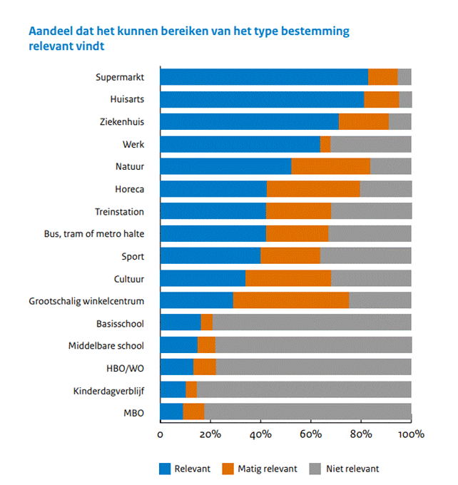
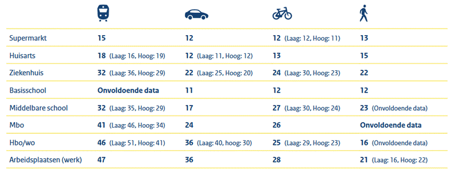
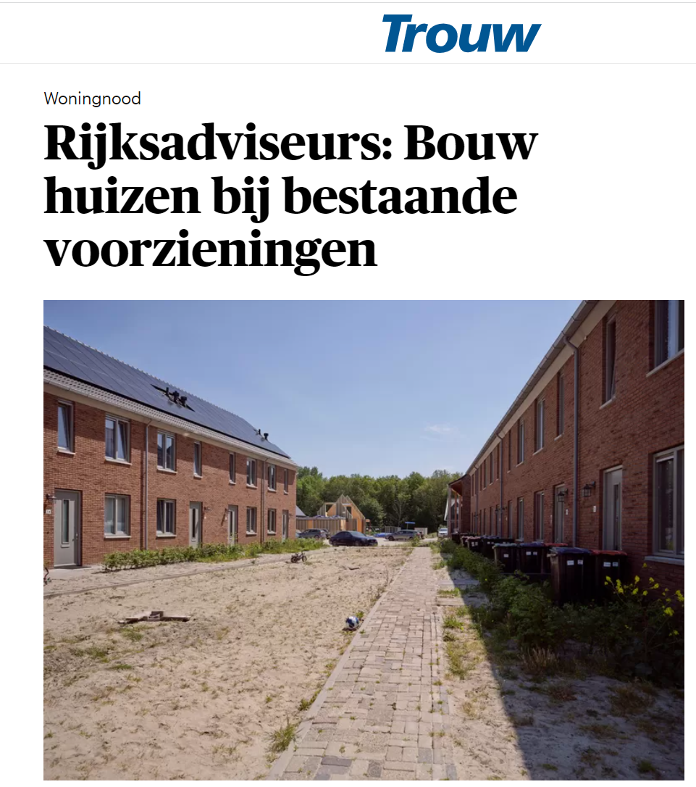

# De kracht van nabijheid

## Samenvatting: breng voorzieningen dichterbij

Met voorzieningen dichtbij hoeven bewoners minder ver te reizen, lopen ze vaker, fietsen ze meer, pakken ze vaker het OV en verbetert hun bereikbaarheid. Als mensen minder afhankelijk van de auto zijn, schept dat ook ruimte voor compacter bouwen van woningen, bedrijvigheid en voorzieningen. Dat komt goed van pas bij de uitdagende [ruimtelijke puzzel](https://www.Zuid-Holland.nl/onderwerpen/ruimte/ruimte/ruimtelijke-koers/) en enorme woningbouwopgave in Zuid-Holland.

Het Rijk hanteert sinds voorjaar 2025 het 'bereikbaarheidspeil' om de bereikbaarheid van voorzieningen in kaart te brengen, zie [Bereikbaarheid op Peil (maart 2025)](https://www.rijksoverheid.nl/documenten/kamerstukken/2025/03/14/kabinetsstandpunt-bereikbaarheid-op-peil). Dat bereikbaarheidspeil richt zich op wat inwoners volgens het onderzoek [Acceptabele bereikbaarheid: een reizigersperspectief](https://web.archive.org/web/20260309155219/https://www.kimnet.nl/binaries/kimnet/documenten/publicaties/2024/09/26/acceptabele-bereikbaarheid-een-reizigersperspectief/KiM+Brochure_Acceptabele+bereikbaarheid_defDT.pdf) (KiM, 2024) belangrijk vinden: zorg, onderwijs, supermarkten en hun werk. In het onderzoek geven mensen aan wat zij acceptabele reistijden vinden, wat weer afhangt van hun vervoermiddel. Het Rijk laat de bereikbaarheid regelmatig voor alle regio's in Nederland (per postcode) in kaart brengen en heeft om te beginnen een nulmeting gedaan.

Voor Zuid-Holland is dit een uitstekende basis al is het advies om ook naar bredere voorzieningen te kijken, omdat die bijdragen aan brede welvaart en een prettig leven. Denk aan de nabijheid van sport & cultuur, horeca, recreatie & groen. En natuurlijk van werk!

Dit is hét moment voor de 'kracht van nabijheid': met een enorme woningbouwopgave (248.000 woningen tot 2030), de [nieuwe Ruimtelijke koers](https://www.Zuid-Holland.nl/onderwerpen/ruimte/ruimte/ruimtelijke-koers/) en de [Ruimtelijk Economische Visie 2025-2050](https://www.Zuid-Holland.nl/actueel/nieuws/december-2024/provincie-Zuid-Holland-lanceert-ruimtelijk/) gaat Zuid-Holland de komende jaren flink op de schop. Dat biedt kansen om in verschillende gebieden te streven naar betere nabijheid. Het kabinet zet het onderwerp bereikbaarheid hoog op de agenda. Kansen liggen er niet alleen bij nieuwbouw, maar ook voor meer nabijheid in bestaande wijken.

**De drie hoofdconclusies uit deze snelstudie:**

1. De kansen van nabijheid van voorzieningen, werk en hoogwaardig openbaar vervoer zijn groot. Als mensen bestemmingen lopend of fietsend (of met OV) kunnen bereiken, biedt dat grote voordelen: betere kwaliteit van leven, minder vervoerarmoede, meer gelijkheid, kortere files en minder uitstoot van CO2, fijnstof en geluid.

2. Deze kansen voor nabijheid kunnen we op vele manieren benutten. De aanpak kan per gebied verschillen. In het algemeen liggen er grote mogelijkheden voor het ontwikkelen van stationsgebieden (ook rond kleinere stations & drukke haltes), het verdichten van bebouwing en het mengen van functies. Hiernaast zijn er tal van andere maatregelen die de nabijheid kunnen verbeteren, zoals het ondersteunen van decentralisatie en verbeteren van infrastructuur voor actieve mobiliteit (lopen en fietsen).

3. De kracht van nabijheid kunnen we overal in de provincie benutten: van hoogstedelijk tot landelijk gebied. Dat vraagt een gebiedsgerichte aanpak omdat de wensen en mogelijkheden per gebiedstype verschillen. Denk aan 15 minuten wijken en 30 minuten regio's, waarbij de auto vaker een rol zal spelen. Ook moeten we nader onderzoeken wat bewoners écht graag in de buurt willen, door mensen in verschillende gebiedstypen te ondervragen. Niet óver inwoners praten, maar mét hen.

## 1. Vraag: kansen van nabijheid?

Zuid-Holland is de provincie met de meeste inwoners en banen per vierkante kilometer. Bovendien wordt het er de komende jaren drukker, omdat er veel woningen en flink wat bedrijvigheid bijkomen. De dichtheid is niet gelijk verdeeld over de provincie. De centra van Rotterdam en Den Haag zijn hoogstedelijk. Verder zijn er kleinere steden, suburbane gebieden, kleine kernen (dorpen) en landelijke gebieden. Al deze gebieden duurzaam bereikbaar maken of houden vraagt om de kracht van nabijheid, met een gebiedsgerichte aanpak.

**Voorzieningen én hoogwaardig OV**

Wáár mensen wonen, werken en recreëren, bepaalt grotendeels hun vervoerskeuze. Een grote afstand betekent haast automatisch langer reizen naar een bestemming en vaker met de auto. Maar als wonen en werken dichtbij voorzieningen en hoogwaardig openbaar vervoer liggen, dan verleid je mensen juist om te lopen, te fietsen of de trein of de bus te pakken. Zie bijvoorbeeld het boek [The 15-Minute City van Carlos Moreno](https://www.rooilijn.nl/publicaties/the-15-minute-city-a-solution-to-saving-our-time-and-our-planet/).
Nog een voordeel: met goede bereikbaarheid te voet of per fiets worden bestemmingen voor (bijna) iedereen toegankelijk. Het biedt inwoners met beperkte mogelijkheden de kans om voorzieningen te gebruiken waartoe ze anders geen toegang hebben. Zo vermindert bereikbaarheid vervoerarmoede en helpt het klimaatdoelen te halen.

**Onderzoeksvraag**

In 2022 beschreef [deze snelstudie dat de ideale woonwijk nabij voorzieningen en hoogwaardig OV ligt](https://kennis.Zuid-Holland.nl/onderzoeken/snelstudie-de-ideale-woonwijk-voorzieningen-en-ov-nabij/). Omdat er tot 2030 ruim 248.000 bijkomen (waarvan een groot deel binnen bestaande steden en dorpen) en het kabinet het onderwerp 'Bereikbaarheid op peil' prominent op de agenda zet, is dit het moment voor meer beleidsfocus op nabijheid. Daarover gaat deze snelstudie, met als onderzoeksvraag:

<table class="table-container"><tbody><tr><td><strong><em>Wat zijn de kansen van nabijheid van voorzieningen en hoogwaardig OV voor Zuid-Holland?</em></strong></td></tr></tbody></table>

Om deze vraag te beantwoorden, kijken we eerst wat mensen graag nabij willen, gevolgd door een blik op de huidige nabijheid in Zuid-Holland. Met deze inzichten kunnen we per gebiedstype kijken hoe de nabijheid beter kan. Dit alles leidt tot aanbevelingen voor kansen van nabijheid van voorzieningen en hoogwaardig OV in Zuid-Holland.

Meer nabijheid vraagt om intensiveren in bestaande steden en dorpen, bouwen hogere dichtheid en meer functiemenging. Dat hoeft niet allemaal hoogbouw te zijn. Een binnenstad met laagbouw kent ook al een flinke dichtheid. Dichtheid en functiemenging geven een gebied kracht om voldoende voorzieningen te dragen. Het [Omgevingsbeleid van de provincie](https://omgevingsbeleid.Zuid-Holland.nl/omgevingsvisie/ambities/44d0fb02-3625-464b-8c20-40947626a184) noemt het streven naar [nabijheid](https://omgevingsbeleid.Zuid-Holland.nl/omgevingsprogramma/maatregelen/d35478ad-9202-4dfa-ba21-41fdedf1dc91) al.

De roep om nabijheid in relatie tot woningbouw is niet nieuw. In 2019 schreef de Rijksadviseur voor de fysieke leefomgeving het advies '<a href="https://www.collegevanrijksadviseurs.nl/adviezen-publicaties/publicatie/2019/10/16/enorm-veel-keuze--ongelofelijk-nabij">Enorm veel keuze &amp; ongelofelijk nabij</a>'. Het is een pleidooi om woningbouw niet te zien als doel, maar als middel om de regio rijker, hechter en schoner te maken: door met bereikbaarheid en verstedelijking de keuzevrijheid en nabijheid te vergroten. 'Enorm veel keuze &amp; ongelofelijk nabij' is opgesteld voor de Metropoolregio Amsterdam (MRA).

## 2. Wat willen mensen dichtbij?

Het Kennisinstituut voor Mobiliteitsbeleid (KiM) heeft in de studie '[Acceptabele bereikbaarheid: een reizigersperspectief](https://web.archive.org/web/20260309155219/https://www.kimnet.nl/binaries/kimnet/documenten/publicaties/2024/09/26/acceptabele-bereikbaarheid-een-reizigersperspectief/KiM+Brochure_Acceptabele+bereikbaarheid_defDT.pdf)' (2024) gekeken welke bestemmingen mensen het relevantst vinden.

*Figuur 1: Aandeel mensen dat het kunnen bereiken van een type bestemming belangrijk vindt (bron: [Acceptabele bereikbaarheid: een reizigersperspectief, KiM 2024](https://web.archive.org/web/20260309155219/https://www.kimnet.nl/binaries/kimnet/documenten/publicaties/2024/09/26/acceptabele-bereikbaarheid-een-reizigersperspectief/KiM+Brochure_Acceptabele+bereikbaarheid_defDT.pdf)).*

Voor het nieuwe bereikbaarheidspeil kiest het kabinet voor acht belangrijke categorieën:

- levensmiddelen (supermarkt)
- zorg (huisarts en ziekenhuis)
- onderwijs (basisschool, middelbare school, mbo- en hbo/wo-instelling)
- werk (arbeidsplaatsen).

*Figuur 2: De gemiddeld acceptabele reistijd in minuten naar acht belangrijke voorzieningen per vervoerwijze. Hoog = hoogstedelijk, laag = laagstedelijk woonmilieu (bron: Bereikbaarheid op peil, 2025).*

Het KiM brengt ook in beeld hoe mensen hun locatie willen bereiken:

*Figuur 3: Vervoerwijzen waarmee mensen een bestemming willen bereiken (bron: [Acceptabele bereikbaarheid: een reizigersperspectief, KiM 2024](https://web.archive.org/web/20260309155219/https://www.kimnet.nl/binaries/kimnet/documenten/publicaties/2024/09/26/acceptabele-bereikbaarheid-een-reizigersperspectief/KiM+Brochure_Acceptabele+bereikbaarheid_defDT.pdf)).*

In het algemeen willen mensen bestemmingen het vaakst met de auto en de fiets kunnen bereiken, vaker dan met het OV. Er zijn verschillen per bestemming: onderwijs moet goed bereikbaar zijn met de fiets en het OV (scholieren zijn natuurlijk ook jong en mogen dus geen auto rijden), terwijl er voor de supermarkt weinig behoefte is aan OV. Door per bestemming de gewenste vervoerwijze(n) te bieden en bestemmingen strategisch aan te sluiten op bestaande verkeers- en vervoerstromen, kunnen we het hele verkeers- en vervoersnetwerk effectiever gebruiken.

Het zou verstandig zijn om breder te kijken dan de acht categorieën die het Rijk hanteert, omdat ook andere, in CBS- en KiM-onderzoek genoemde categorieën tot bredere welvaart en een prettiger leven leiden:

- sport & cultuur & horeca
- groen & natuur.

**Nabijheid is politieke keuze**
Ook het Planbureau voor de Leefomgeving heeft in de studie '[Beter bereikbaar? Veranderingen in de toegang tot voorzieningen en banen in Nederland tussen 2012 en 2022](https://www.pbl.nl/publicaties/beter-bereikbaar)' (PBL, 2024) onderzoek gedaan naar bereikbaarheid. Daaruit blijkt dat het afschalen van het openbaar vervoer (minder lijnen, minder ritten en minder haltes door bezuinigingen en na corona) heeft geleid tot minder bereikbaarheid van voorzieningen en banen: "Veranderingen in bereikbaarheid zijn het gevolg van politieke keuzes en zijn relevant voor beleidsmakers. Want de afschaling van het openbaar vervoer, de concentratie van voorzieningen in stedelijk gebied en de verschuiving van werkgelegenheid naar autolocaties zijn in belangrijke mate het gevolg van politieke keuzes".

**Fiets en OV kunnen beter**

In de studie '[Toegang voor iedereen?](https://www.pbl.nl/publicaties/toegang-voor-iedereen)' (PBL, 2022) heeft het Planbureau voor de Leefomgeving indicatoren ontwikkeld voor de bereikbaarheid van voorzieningen en banen met verschillende vervoerwijzen. Uit die studie blijkt dat werk en voorzieningen minder goed bereikbaar zijn voor mensen die de fiets of het OV (moeten) gebruiken dan voor mensen met (toegang tot) een auto. Dit geldt niet alleen in landelijk gebied, maar ook voor de stadsranden of suburbane kernen. In de [podcast Vervoerarmoede](https://www.pbl.nl/actueel/podcast/vervoersarmoede-26-minuten-en-34-seconden) licht PBL-onderzoeker Jeroen Bastiaanssen dat toe.

**Factoren voor bereikbaarheid**
Welke voorzieningen mensen graag snel willen kunnen bereiken, hangt af van veel factoren. Factoren die van belang lijken zijn volgens het [KiM (2024)](https://web.archive.org/web/20260309155219/https://www.kimnet.nl/binaries/kimnet/documenten/publicaties/2024/09/26/acceptabele-bereikbaarheid-een-reizigersperspectief/KiM+Brochure_Acceptabele+bereikbaarheid_defDT.pdf):

levensfase

Scholen scoren in de lijst van het KiM relatief laag, maar voor kinderen, jongeren en gezinnen met jonge kinderen blijkt de bereikbaarheid van onderwijs heel belangrijk.

vervoermiddel

Werk, ziekenhuis en winkelcentrum mogen vooral met de auto bereikbaar zijn (voor wie toegang heeft tot een auto). Naar school, sport en stations gaan mensen het liefst op de fiets. Mbo-, hbo- en wo-instellingen vragen om goed OV. Naar basisscholen, bus- en tramhaltes en metrostations willen mensen vooral kunnen lopen.

reistijd

Mensen zijn gemiddeld bereid langer te reizen naar hun werk dan naar een supermarkt. En ze vinden een langere reistijd <a href="https://www.kimnet.nl/publicaties/publicaties/2023/12/04/nieuwe-waarderingskengetallen-voor-reistijd-betrouwbaarheid-en-comfort">acceptabeler met het OV</a> dan met de auto.

gebiedstype (mate van stedelijkheid)

Mensen in dichtbevolkt, stedelijk gebied hanteren hogere standaarden voor voorzieningen en bereikbaarheid dan mensen in dunbevolkt gebied, die vaak ook andere voorzieningen hoog op hun lijstje hebben staan. Hoewel deze verschillen in verwachtingen en daadwerkelijke nabijheid groot kunnen zijn, kan de ervaren tevredenheid van nabijheid dichter bij elkaar liggen.

## 3. Hoe is de nabijheid nu in Zuid-Holland?

<em>We wachten nog op de door het kabinet aangekondigde nulmeting per postcode. Zodra die meting er is, voegen we die aan deze snelstudie toe.</em>

Om nabijheid binnen Zuid-Holland te verbeteren, moeten we eerst zicht hebben op de nabijheid van voorzieningen inclusief hoogwaardig OV. Op basis van [CBS-data](https://www.cbs.nl/nl-nl/cijfers/detail/85560NED#shortTableDescription) is voor elk gebied van 500 bij 500 meter in Nederland de afstand tot voorzieningen en het aantal voorzieningen binnen een bepaalde straal berekend. Verderop staat een deel van deze data op kaarten.

**Stedelijkheidsklassen**

Omdat de toegang tot voorzieningen en OV samenhangt met het aantal inwoners en banen per km2, kijken we eerst naar stedelijkheidsklassen zoals gedefinieerd in het '[Dashboard Verstedelijking](https://www.studiobereikbaar.nl/projecten/dashboard-verstedelijking/)' ([College voor Rijksadviseurs](https://www.collegevanrijksadviseurs.nl/projecten/dashboard-verstedelijking) & [Studio Bereikbaar](https://www.studiobereikbaar.nl/projecten/dashboard-verstedelijking/)):

<table class="table-container"><tbody>
<tr><td><em>stedelijkheidsklasse</em></td><td><em>inwoners + banen per km2</em></td></tr>
<tr><td>hoogstedelijk</td><td>&gt; 12.500</td></tr>
<tr><td>stedelijk</td><td>6.000 – 12.500</td></tr>
<tr><td>suburbaan</td><td>4.000 – 6.000</td></tr>
<tr><td>laag suburbaan</td><td>2.000 – 4.000</td></tr>
<tr><td>dorps</td><td>1.000 – 2.000</td></tr>
<tr><td>landelijk</td><td>&lt; 1.000</td></tr>
</tbody></table>

Voor Zuid-Holland staat deze indeling op onderstaande interactieve kaart. Voor meer informatie kun je inzoomen en klikken op elk blokje van 500 bij 500 meter (klik voor full screen [kaart *stedelijkheidsklasse*](https://provincie-Zuid-Holland.github.io/mobiliteit/kaart?par=10)).

<iframe src="https://provincie-Zuid-Holland.github.io/mobiliteit/kaart?par=10" width="100%" height="600"></iframe>

**Nabijheidscore**

Per blokje van 500 bij 500 meter zijn er ook kaarten met een nabijheidsscore van voorzieningen in Zuid-Holland. Deze score gaat van 1 (slecht) tot 9 (uitstekend) en gebruikt een gewogen gemiddelde, ook op basis van CBS-data. Met een weging per voorziening (OV, winkels, onderwijs, zorg, sport & cultuur, horeca, groen) kun je de algemene nabijheidsscore berekenen, ook te zien in de tool.

Op onderstaande kaart zijn de verschillende voorzieningen gewogen. Je kunt ook doorklikken op de nabijheid per voorziening en voor detailinfo (klik voor [full screen kaart nabijheid voorzieningen](https://provincie-Zuid-Holland.github.io/mobiliteit/kaart?par=1)).

<iframe src="https://provincie-Zuid-Holland.github.io/mobiliteit/kaart?par=1" width="100%" height="600"></iframe>

Je kunt deze tool ook voor je eigen woon- of werkplaats gebruiken: kijk hoe jouw gebied scoort op het gebied van nabijheid. In hoofdstuk 4 van deze snelstudie vind je per stedelijkheidsklasse voorbeelden op basis van de nabijheidscore.

Over het algemeen is de nabijheid in steden hoger: mede door de hoge bevolkingsdichtheid worden voorzieningen naar de stad toegetrokken. Minder stedelijke gebieden scoren lager en hebben een uitdaging voor verbetering. Suburbane gebieden met een relatief goede bereikbaarheid en nabijheid van voorzieningen bieden kansen voor woningbouw in combinatie met het verder verbeteren van de nabijheid.

## 4. Voorbeelden & kansen per stedelijkheidsklasse

Hieronder staan voorbeelden per *stedelijkheidsklasse* (op basis van het aantal inwoners plus arbeidsplaatsen per km² zijn zes stedelijkheidsklasses gedefinieerd).

<strong>Hoogstedelijk: CID &amp; Binkhorst</strong> (nabijheidsscore 7,5 – 8,5)

<a href="https://www.move-rdh.nl/projecten/mirt-verkenning+cid+binckhorst/default.aspx">Central Innovation District Binkhorst</a> tussen de stations Den Haag HS en CS is een mooi voorbeeld van hoe nabijheid en woningbouw elkaar kunnen versterken. In de komende jaren komen hier vele woningen en banen bij. Dit wordt <a href="https://www.Zuid-Holland.nl/publish/pages/27729/bijlage_startdocument_mirt-verkenning_mobiliteit_cid_-_binckhorst.pdf">ondersteund</a> met een nieuwe tramlijn, veilige fietsroutes en een aantrekkelijke leefruimte.

<ul>
<li>een van hoogste verdichtingen van Nederland</li>
<li>goed OV in de buurt én aandacht voor beter OV</li>
<li>aandacht voor betere fiets en wandel infrastructuur</li>
<li><a href="https://mrdh.nl/project/bereikbaarheid-recreatie-natuurgebieden">bereikbaarheid van natuur en recreatie</a></li>
</ul>

<video controls style="max-width:100%"><source src="img/img-nabijheid/animatie-den-haag-cid.mp4" type="video/mp4"></video>

Kans voor hoogstedelijke gebieden: tijdig investeren in infrastructuur, ook voor de mobiliteitstransitie (naar actieve mobiliteit en minder fossiel verkeer en vervoer). Andere hoogstedelijke voorbeelden: Merwede: in Utrecht komt de grootste binnenstedelijke en autovrije <a href="https://web.archive.org/web/20260309155219/https://www.utrecht.nl/wonen-en-leven/bouwprojecten-en-stedelijke-ontwikkeling/bouwprojecten/bouwprojecten-in-zuidwest/merwedekanaalzone/projecten-in-de-merwedekanaalzone/merwede">wijk</a> van Nederland; <a href="https://www.littlecoolhaven.nl/little-c/">Little C, Coolhaven Rotterdam</a>: wonen en werken in hoge dichtheid; nieuw metrostation Hoek van Holland Strand: brengt Rotterdam(mers) bij de zee.

<strong>Stedelijk: Spoorzone Nieuw Delft</strong> (nabijheidsscore 7,9)

Sinds de trein ondergronds rijdt in Delft, wordt het stedelijke gebied rond het station opgeknapt. In de spoorzone Nieuw Delft worden woningen gebouwd op loopafstand van hoogwaardig OV en het centrum van de stad.

<ul>
<li>goed OV (trein, tram, bus)</li>
<li>goede verbinding met (voorzieningen in) binnenstad</li>
</ul>

Kans voor stedelijke gebieden: meer functiemenging (voorzieningen, wonen én werken).

Andere stedelijke voorbeelden: Dordtse Spoorzone: extra woningen &amp; meer groen; Goudse Spoorzone: verbinding met historisch centrum; stationsgebied Leiden &amp; Bio Science Park: aantrekkelijker, duurzamer &amp; groener als gastvrije entree stad.

<strong>Suburbaan: Spijkenisse Centrum</strong> (nabijheidsscore 7,8 – 8,0)

Het metro- en busstation Spijkenisse Centrum wordt <a href="https://web.archive.org/web/20260309155219/https://www.voorne-putten.nl/nieuws/algemeen/187833/volgende-fase-herinrichting-metrostation-start-in-januari">gerenoveerd</a>. Ook het omliggende gebied wordt opgeknapt en er komen twee nieuwe wooncomplexen met een <a href="https://www.planviewer.nl/imro/files/NL.IMRO.1930.BPBliekstraat-3001/b_NL.IMRO.1930.BPBliekstraat-3001_tb1.pdf">lagere parkeernorm</a>. Dit is een voorbeeld van 'transit oriented development' (TOD): woningen en voorzieningen rond knooppunten van stadsgewestelijk openbaar vervoer. Mensen die wonen of werken rond hoogwaardig OV gebruiken dat OV of actieve vervoerwijzen vaker in plaats van de auto.

<ul>
<li>goed gebruik van rail- en businfrastructuur</li>
<li>goede voorzieningen</li>
</ul>

Kansen voor suburbane gebieden: <a href="https://web.archive.org/web/20260309155219/https://www.bnr.nl/podcast/vastgoed-gezocht/10561689/veel-woningbouw-mogelijk-in-kleinere-stationsgebieden">verdichting</a> en meer functiemenging (voorzieningen, wonen én werken).

Andere suburbane voorbeelden: Hoekse Lijn, <a href="https://dezwartehond.nl/van-strand-tot-stad-de-zwarte-hond-onderzoekt-de-ontwikkelkansen-aan-de-hoekse-lijn/">van strand tot stad</a>: meer wonen, werken &amp; voorzieningen rond metrostations; Stationsgebied Leidschenveen: rond het <a href="https://studiosk.nl/projecten/lokale-stations/station-leidschenveen/">station</a> zijn woningen en verbinding met RandstadRail en ander HOV (tram en bus).

<strong>Laag suburbaan: Hellevoetsluis</strong> (nabijheidsscore 6,0 – 7,8)

Hellevoetsluis op Voorne-Putten is minder goed aangesloten op OV (alleen bus, geen rail), maar het centrum biedt voldoende voorzieningen.

<ul>
<li>goede nabijheid van voorzieningen</li>
<li>met bus en (vanuit Spijkenisse met) metro verbonden met Rotterdam</li>
</ul>

Kans voor laag suburbane gebieden: nieuwe woonwijken als <a href="https://web.archive.org/web/20260309155219/https://www.groothellevoet.nl/nieuws/algemeen/194015/vragen-over-ontsluiting-nieuwbouwproject-boomgaard">De Boomgaard</a> kunnen dichtheid verder verhogen en nieuwe voorzieningen aantrekken.

<strong>Dorps: Middelharnis</strong> (nabijheidsscore 4 – 6,9)

Middelharnis op Goeree-Overflakkee scoort aardig op nabijheid, al neemt die wat verder van het centrum af.

<ul>
<li>hoge nabijheid van scholen &amp; zorg</li>
</ul>

Kansen voor dorpse gebieden: vestigingsklimaat verbeteren zodat de aanwezige kern kan blijven bestaan, waar wenselijk verdichting toepassen (met oog op het karakter en de wensen/mogelijkheden per dorp).

<strong>Landelijk: Nieuwkoop</strong> (nabijheidsscore 2,4 – 7,4)

De kern Nieuwkoop in het Groene Hart scoort hoog met een 7,4; in omliggende dorpen daalt dit naar een 4,0 (alleen de nabijheid van horeca is redelijk).

<ul>
<li>veel natuur en recreatie</li>
</ul>

Kans voor landelijke gebieden: behoeften bewoners in kaart brengen (bijvoorbeeld tekort aan zorg).

## 5. Aanbevelingen voor meer nabijheid (op lange termijn)

*(Alle ▶ kun je uitklappen door te klikken)*

<strong>Bouw rond stations (en vergeet kleine stations en drukke bushaltes niet)</strong>

Binnenstedelijk bouwen in hoge dichtheid bij OV-knooppunten loont. Bouw woningen gemengd met winkels, zorgcentra, horeca en werkgelegenheid in bestaande steden en dorpen rond de knoop. En voorkom dat er bij HOV-haltes wordt gebouwd in lage dichtheid (zoals woningen met een hoge parkeernorm). We hebben stationslocaties langs de Oude Lijn (Leiden – Dordrecht) goed in het vizier. Maar laten we ook andere stations en HOV-knooppunten niet vergeten. Vaak is daar nog ruimte voor <a href="https://dezwartehond.nl/van-strand-tot-stad-de-zwarte-hond-onderzoekt-de-ontwikkelkansen-aan-de-hoekse-lijn/">binnenstedelijk bouwen</a>. 
<a href="https://www.pbl.nl/uploads/default/downloads/pbl-2022-toegang-voor-iedereen-4932.pdf">Deelfietsen</a> en deelauto's (zoals Greenwheels en MyWheels) bij knooppunten kunnen het (H)OV-gebruik verhogen voor mensen die doorreizen naar verdere bestemmingen. Deelvervoer past dan ook prima bij 'transit oriented development'.

<strong>Verdicht leefgebieden</strong>

Stedelijke verdichting en herinrichting van de publieke ruimte is de goedkoopste manier om de bereikbaarheid te verbeteren en tegelijk het aandeel van de auto op een natuurlijke manier te verminderen, blijkt uit het onderzoeksprogramma Duurzame bereikbaarheid van de Randstad (NWO, 2015). Dankzij verdichting kan een hoger inwonertal de voorzieningen op peil houden. Dat kan leiden <a href="https://www.pbl.nl/uploads/default/downloads/PBL-2012-Stedelijke-verdichting-500233001.pdf">tot aantrekkelijker steden</a> met een betere leefbaarheid en nabijheid. Naast het bijbouwen van woon- en werkruimte kun je denken aan het splitsen van woningen, het maximaliseren van kavelgebruik (gestapelde en/of ondergrondse bouw) en het herbestemmen van kantoorpanden en/of bedrijventerreinen. 
In kleine kernen moeten basisvoorzieningen blijven of terugkomen, waardoor ook daar mensen minder afhankelijk worden van de auto. Het gaat dan om huisarts, school, supermarkt, bushalte, bibliotheek en café. Voor voldoende draagvlak voor deze voorzieningen is – ook in dorpen – verdichting van woningen en bedrijven nodig. (H)OV-verbindingen kunnen kernen onderling verbinden en met grotere plaatsen.

<strong>Meng allerlei functies</strong>

Door functies binnen wijken te mengen, kunnen wonen, werken, winkelen en recreatie samengaan en verbetert de levendigheid. Werklocaties in wijken leiden tot minder woon-werkverkeer. Daarnaast creëert functiemenging levendigere wijken (meer 'reuring'), die het <a href="https://www.collegevanrijksadviseurs.nl/adviezen-publicaties/publicatie/2019/04/11/reos-advies">delen van voorzieningen en het investeren in de wijk</a> makkelijker maken.

Kijk daarbij naar alle voorzieningen. Het kabinet kiest voor 'Bereikbaarheid op peil' voor acht belangrijke voorzieningen. Voor brede welvaart zou het goed zijn nog wat breder te kijken. Denk hierbij aan sport, horeca en natuur.

<strong>Verbeter wandel- en fietspaden</strong>

Lopen en fietsen passen bij een goede nabijheid. Betere kwaliteit en beleving van wandel- en fietsnetwerken (aantrekkelijke, veiliger routes, betere paden, bredere paden, doorfietsroutes, nieuwe routes) vergroot het gebruik. Dit levert <a href="https://kennis.Zuid-Holland.nl/fiets/">allerlei voordelen</a> op voor zowel de wandelaar/fietser zelf, als de <a href="https://www.kimnet.nl/publicaties/publicaties/2023/12/04/nieuwe-waarderingskengetallen-voor-reistijd-betrouwbaarheid-en-comfort">samenleving als geheel</a> (<a href="https://web.archive.org/web/20260309155219/https://www.rijkswaterstaat.nl/zakelijk/zakendoen-met-rijkswaterstaat/werkwijzen/werkwijze-in-gww/communicatie-bij-werkzaamheden/werkwijzer-hinderaanpak/toolbox-slim-reizen/factsheet-upgrade-fietsinfrastructuur">maatschappelijke baten</a>). Cruciaal is dat we niet alleen netwerken verbeteren, maar dat we ook bestemmingen eenvoudiger toegankelijk maken voor wandelaars en fietsers (denk aan stallingen).

<strong>Verlaag parkeernormen</strong>

Het verdichten van leefgebieden en mengen van functies is vaak moeilijk vanwege hoge parkeernormen (veel parkeerplekken) voor woningen en werkbestemmingen. Met de mogelijkheid om te differentiëren met parkeernormen per gebied, wordt mengen haalbaarder en wordt autogebruik voor korte ritjes minder aantrekkelijk. Voor nieuwe gebouwen bij grote stations liggen de parkeernormen vaak lager, maar bij kleine stations of HOV-haltes kunnen parkeernormen ook omlaag. Deelvervoer kan de vervoerbehoefte op die plekken ondersteunen.

<strong>Bied ruimte aan lokale initiatieven met een goed vestigingsklimaat</strong>

Centralisatie van onder meer middelbare scholen en ziekenhuizen heeft gezorgd voor een grotere afstand tussen inwoners en hun voorzieningen. Inmiddels is het meer een uitdaging om voorzieningen te behouden, het vestigingsklimaat te verbeteren en lokale initiatieven te stimuleren. 
Onderzoeken, zoals <a href="https://www.kimnet.nl/publicaties/publicaties/2024/09/26/acceptabele-bereikbaarheid-een-reizigersperspectief">van het KiM</a>, tonen aan dat voorzieningen als onderwijs, werk en ziekenhuis meer nabijheid, dus decentralisatie vereisen. In plaats van bewoners naar het ziekenhuis of zorgcentrum te laten reizen, kun je ook filialen (of spreekuren) dichtbij bewoners vestigen (of zaken digitaal afhandelen). 
En door MKB'ers te ondersteunen hun bedrijfspanden te behouden, kunnen kernen levendig blijven. Zo kun je een sociaal huurstelsel invoeren om kleine bedrijven voordeliger ruimte te laten huren.

Zorg voor goed te gebruiken buitenruimten (zoals pleinen) en goede multifunctionele binnenruimten om elkaar te ontmoeten (bibliotheken, buurthuizen, dorpscentra): maak het mogelijk dat mensen bij elkaar kunnen komen en activiteiten kunnen organiseren/ondernemen.

Om in kernen een goed vestigingsklimaat te creëren of te houden, is kennis nodig waaraan (kleine) ondernemers behoefte hebben. Denk aan financiële ondersteuning, betere bereikbaarheid of meer inwoners rond hun bedrijf. Met een goed beeld van de situatie kun je vervolgens kijken naar economische verdienmodellen, waardoor het aantrekkelijk is, blijft of wordt om je in kernen te vestigen.

<strong>Verbeter OV: HOV &amp; hubs</strong>

Het wegennet in de provincie is zwaar belast. Verdere uitbreiding leidt vaak alleen maar tot meer automobiliteit en daarmee niet direct tot een oplossing. Bovendien zijn de middelen hiervoor beperkt. Dit vraagt om andere manieren om van A naar B te komen. Nabije voorzieningen kunnen helpen om mobiliteit te voorkómen en om autokilometers te beperken. Hoogwaardig OV kan bijdragen aan het (in afstand of reistijd) dichterbij brengen van voorzieningen en het ontlasten van wegen. Hubs bij railstations, HOV-knooppunten en/of in dorpskernen met OV-fietsen of ander deelvervoer kunnen het bereik van het OV vergroten.

<strong>Zet nabijheid voor brede welvaart óók in lokaal beleid</strong>

Nabijheid in beleid – ook in gemeentelijk beleid – kan uiteindelijk de '<a href="https://www.cbs.nl/nl-nl/dossier/dossier-brede-welvaart-en-de-sustainable-development-goals/monitor-brede-welvaart-en-de-sustainable-development-goals-2023/brede-welvaart/hier-en-nu#5">brede welvaart</a>' vergroten. Brede welvaart is alles wat mensen hier en nu van waarde vinden, ook voor later en elders: bijvoorbeeld bereikbaarheid, gezondheid, leefomgeving, natuur, rechtvaardigheid, sociale samenhang en veiligheid. Nabijheid kun je bijhouden in een voortgangsmonitor per wijk of stadsdeel.

<strong>Ga in gesprek over nabijheid en creëer een basispeil</strong>

Ga het gesprek over nabijheid aan: wat zijn de voordelen en waar zit ruimte voor verdichting, functiemenging, hoogwaardig OV en hubs? Ga ook zeker het gesprek aan met inwoners: welke voorzieningen zijn gewenst om wijken, buurten en kernen leefbaar te houden? Wat moeten we daar naast het 'bereikbaarheidspeil' bij betrekken? En hoe verbeteren we wandel- en fietspaden, openbaar vervoer en deelvervoer?

## 6. Aanbevelingen voor meer nabijheid (op korte termijn)

<strong>Stimuleer deelvervoer</strong>

Deelauto's maken het mogelijk om laagdrempelig auto te rijden. Enerzijds kan het autobezit dalen als meer mensen voor een deelauto kiezen, anderzijds zullen mensen dan ook bewuster de auto gebruiken. Op de korte termijn kunnen overheden locaties voor deelauto's aanwijzen en hubs of app-groepen voor deelautogebruik ondersteunen. Daarnaast kunnen overheden stimuleren dat er deelfietsen (zoals de OV-fiets) bij álle rail- en busstations, HOV-haltes en hubs reizigers komen te staan voor het laatste deel van de reis. Zie <a href="https://provincie-Zuid-Holland.github.io/mobiliteit/kaart?p=oranje&amp;regio=gem">bijvoorbeeld waar nu al oranje deelfietsen van Donkey Republic staan bij ov</a>. Beter deelfietsaanbod verbetert het treingebruik blijkt uit <a href="https://kennis.Zuid-Holland.nl/treingebruik-deelfiets/">onderzoek</a> van Roland Kager, Studio Bereikbaar.

<strong>Denk aan foodtrucks en andere flexvoorzieningen op locatie</strong>

In kleine kernen verdwijnen restaurants en cafés. Als het niet mogelijk is om deze te ondersteunen en te laten terugkomen, kunnen foodtrucks een alternatief bieden voor meer variatie en keuzevrijheid. Op deze manier kan een restaurant een bredere doelgroep bedienen en hebben inwoners de mogelijkheid om buiten de deur te eten. Een goed voorbeeld is de mobiele koffiebar die elke ochtend bij het station Delft Campus staat.

<strong>Geef bewoners OV-abonnement</strong>

Bij de meeste woningen kun je gratis een parkeerplek voor de deur krijgen. Waarom zou je bewoners geen gratis of voordelig OV-abonnement bij hun (nieuwe) woning kunnen geven? Voor mensen in de buurt van een station, zou dit ander reisgedrag teweeg kunnen brengen.

<strong>Creëer flexibele werkplekken</strong>

De afgelopen jaren is het voor werknemers makkelijker geworden om vanuit huis te werken en niet naar kantoor te gaan. Door flexibele werkplekken te stimuleren – zoals koffietentjes, wijkcentra en flexplekken bij stations – hoeven inwoners niet ver naar kantoor te reizen als ze buitenshuis willen werken.

**Meer lezen?**
Inspirerende en interessante onderzoeken voor meer diepgang in de 'kracht van nabijheid':

- [Omgevingsbeleid bereikbaar Zuid-Holland](https://omgevingsbeleid.Zuid-Holland.nl/omgevingsvisie/ambities/44d0fb02-3625-464b-8c20-40947626a184) (februari 2025)
- [Ruimtelijke koers voor Zuid-Holland](https://www.Zuid-Holland.nl/onderwerpen/ruimte/ruimte/ruimtelijke-koers/) (maart 2024)
- [Ruimtelijk Economische Visie 2025-2050 Zuid-Holland](https://www.Zuid-Holland.nl/actueel/nieuws/december-2024/provincie-Zuid-Holland-lanceert-ruimtelijk/) (december 2024)
- [*The 15-Minute City*, Carlos Moreno](https://www.rooilijn.nl/publicaties/the-15-minute-city-a-solution-to-saving-our-time-and-our-planet/) (boekrecensie)

<em>Tot slot het Afstudeeronderzoek van Max (<a href="https://maxkl.nl/pdf">https://maxkl.nl/pdf</a>) wat hij bij de provincie uitvoerde:</em> 
<strong>Travel behaviour in suburban areas:</strong> A case study in the province of Zuid-Holland  
In de provincie Zuid-Holland is het autobezit en -gebruik de afgelopen twintig jaar sterk toegenomen. Die grote stijging brengt uitdagingen met zich mee, zoals meer ruimtebeslag, langere files en lastiger woningbouw (waar laten we die auto's, hoe laden we ze op). De stijging is vooral te zien buiten grote steden, op het platteland, maar ook in suburbane gebieden tussen stad en platteland (denk aan de randen van Rotterdam en Den Haag, gemeenten rond Leiden en de Drechtsteden). Dit afstudeeronderzoek onderscheidt zeven verschillende gebiedstypes, waarvan vier suburbaan. Uit het onderzoek blijkt dat het reisgedrag in suburbane gebieden varieert: sommige neigen qua autogebruik meer naar de stad, andere meer naar landelijke gebieden. Wel valt in suburbane gebieden op dat de mensen voor korte afstanden vaker de auto pakken dan in de stad. Zo gaat in een suburbaan gebied ruim 30 procent van woon-werkverkeer tot 5 kilometer met de auto, tegen 10 procent in de stad. Zelfs voor afstanden tot 2 kilometer pakken mensen in suburbane gebieden voor 18 procent van de ritten de auto. Dit hogere autogebruik in suburbane gebieden, zelfs voor korte afstanden, is opmerkelijk omdat deze gebieden vaak bij dagelijkse voorzieningen liggen en er bovendien alternatieven zijn, zoals de fiets en het OV. Ook in suburbane stationsgebieden liggen autobezit en -gebruik nog steeds hoog, bijna vergelijkbaar met de rest van het suburbane gebied. Stationsgebieden, vooral de gebieden langs de Oude Lijn met een hoge treinfrequentie van zes keer per uur, bieden kansen voor een lager autogebruik. Voor deze stationsgebieden is wel apart beleid nodig. 
Meer info: <a href="https://maxkl.nl/">https://maxkl.nl</a>

<h2>Bouw nabij voorzieningen en OV-haltes</h2>

"In plaats van grootschalige woningbouwprojecten in buitengebieden zouden kabinet en lagere overheden moeten inzetten op het bouwen van woningen voor starters en senioren in de buurt van bestaande voorzieningen" stelt het College van Rijksadviseurs <a href="https://www.trouw.nl/duurzaamheid-economie/rijksadviseurs-bouw-huizen-bij-bestaande-voorzieningen~b58930d3/">(Trouw 19 okt'22)</a> in hun <a href="https://www.collegevanrijksadviseurs.nl/actueel/nieuws/2022/10/18/rijksadviseurs-roepen-op-bouw-in-de-buurt">leidraad 'Bouw in de buurt'</a>. Vooral starters en senioren hebben behoefte aan een woning waarbij voorzieningen goed geregeld zijn waarmee de doorstroming op gang komt.

<iframe width="100%" height="315" src="https://www.youtube.com/embed/dABncClRQKk" title="Barcelona Superblocks: A livable city through low-traffic zones" frameborder="0" allow="accelerometer; autoplay; clipboard-write; encrypted-media; gyroscope; picture-in-picture" allowfullscreen></iframe>

<h2>Superblocks Barcelona</h2>

Geef de stad terug aan de voetganger. Dat is in één zin samengevat het concept van de <a href="https://web.archive.org/web/20260309155219/https://www.verkeersnet.nl/duurzaamheid/11252/barcelona-zet-op-superblocks/#:~:text=Het%20superblock%2Dconcept%20houdt%20in,en%20dergelijke%20en%20soms%20bewoners.">superblocks</a> dat in Spanje opgang maakt. De stad wordt opgedeeld in blokken van zo'n 400 x 400 meter. De maximumsnelheid wordt teruggebracht naar 30 of 20 km/uur, zodat voetgangers en fietsers zich veilig kunnen verplaatsen.

## Linkjes & bronnen

{% include klikblok.html
   img="https://i.mgtbk.nl/boeken/9781394228140-460x480.jpg?_=none_0"
   title="Carlos Moreno The 15-Minute City; A Solution to Saving Our Time and Our Planet"
   url="https://rooilijn.nl/recensies/de-kracht-van-nabijheid/"
   text="Carlos Moreno slaat opnieuw op de trom met een pleidooi voor de kracht van nabijheid met zijn boek The 15-Minute City. Hij zet daarbij hoog in met de ondertitel “A Solution to Saving Our Time and Our Planet”. Het is een vurig pleidooi voor een structureel andere inrichting van onze steden, gebaseerd op de nabijheid van wonen, werken en voorzieningen. (recentie door Bjarne van der Drift en Ronald Haverman)" %}

## Afkortingen & begrippen

- **CBS**: Centraal Bureau voor de Statistiek
- **HOV**: hoogwaardig (betrouwbaar, comfortabel, frequent en snel) openbaar vervoer
- **KiM**: Kennisinstituut voor Mobiliteitsbeleid
- **OV**: trein, RandstadRail, metro, tram, bus, buurtbus, Waterbus
- **STOMP**: voorkeursvolgorde voor duurzame mobiliteit; stappen, trappen, OV, mobiliteitsdiensten en privéauto. Eérst lopen en fietsen (actieve mobiliteit) en OV (collectief vervoer); die zijn beter voor de gezondheid, luchtkwaliteit en veiligheid
- **TOD**: *transit oriented development*; woningen en voorzieningen rond knooppunten van stadsgewestelijk railvervoer (trein-, RandstadRail- en metrostations)
- **Vervoerarmoede**: sociale uitsluiting als mensen buiten hun macht niet volledig kunnen meedoen in de samenleving door gebrekkige verplaatsingsmogelijkheden (bron: [https://repository.ubn.ru.nl/bitstream/handle/2066/95490/95490.pdf](https://repository.ubn.ru.nl/bitstream/handle/2066/95490/95490.pdf))

---

- Igor Koster, [i.koster@student.tue.nl](mailto:i.koster@student.tue.nl)
- Sean van der Lee, [jct.vander.lee@pzh.nl](mailto:jct.vander.lee@pzh.nl)
- Ronald Haverman, [ra.haverman@pzh.nl](mailto:ra.haverman@pzh.nl)
