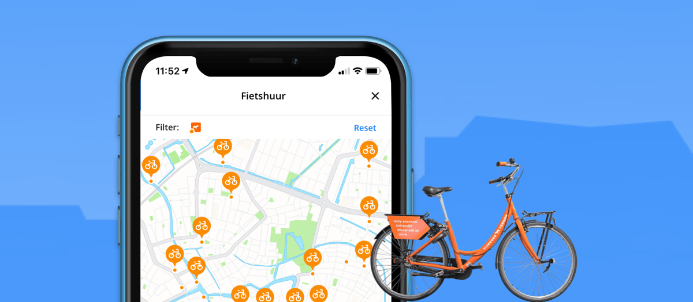

<strong>Drie maanden gratis deelfietsen cadeau</strong>

Deelfietsen zijn ideaal voor het laatste stuk van je reis, 
bijvoorbeeld van het station of de bushalte naar je werk of school. 
Frederik Zevenbergen, gedeputeerde Verkeer &amp; Vervoer, stimuleert de 
deelfietsen met een goede reden: "Het is snel, gebruiksvriendelijk en 
gezond. De combinatie van OV en fiets maakt steden, dorpen, 
bedrijventerreinen en woonwijken bereikbaarder". De deelfietsen vormen 
een oplossing voor de laatste kilometers van je reis in de meeste 
gemeenten in Zuid-Holland (27 van de 50 gemeenten, waaronder Den Haag, 
Delft, Dordrecht, Gorinchem, Leiden, Katwijk en Oegstgeest).

<h2>Drie maanden gratis deelfietsen? Doe mee!</h2>

Mensen die een bestemming hebben 1 tot 3 km van een station waar deze
 oranje deelfietsen staan (zie onderstaande kaart) kunnen een gratis 
abonnement aanvragen (*in samenwerking met <em>Zuid-Holland Bereikbaar</em> en de <em>gemeente Den Haag</em>).

<figure></figure>

<strong>Daily Rider abonnement</strong>

Drie maanden gratis!

<ul>
<li>Pak drie maanden <strong>gratis</strong> oranje deelfietsen.</li>
<li>Fiets naar je bestemming en laat de fiets achter bij een hub.</li>
<li>Je kunt zoveel fietsritten maken als je wilt met een totale tijd van maximaal 2 uur per dag.</li>
<li>Voor 1,50 mag je de fiets de hele dag (12 uur) bij je houden. Je hoeft hem dan tussendoor niet bij een hub in te leveren (dat is 3 x voordeliger dan ov-fiets).</li>
<li>Je zit nergens aan vast, stopt vanzelf.</li>
<li>Je fiets dan overal gratis waar Donkey Republic-fietsen staan.</li>
</ul>

<a href="https://www.zuidhollandbereikbaar.nl/reizigers/acties-voor-reizigers/3-maanden-gratis-een-donkey-deelfiets" target="_blank" rel="noreferrer noopener"><strong>Haal je vouchercode op bij Zuid-Holland Bereikbaar</strong></a>

<strong><a href="#toelichting">De vouchercode staat ook onderaan deze pagina bij de toelichting over Donkey en de actie</a>.</strong>

<strong>Veel kansen voor combinatie OV en fiets</strong> In 
Nederland fietsen we veel, maar meestal in de buurt van onze woonplaats,
 omdat je daar een fiets hebt. Deelfietsen hebben de potentie om ons 
fietsgebruik enorm uit te breiden door mensen in de gelegenheid te 
stellen overál een fiets te pakken. Op onderstaande kaart zie je bij 
welke OV-haltes de oranje deelfiets beschikbaar is.

<iframe src="https://provincie-zuidholland.github.io/mobiliteit/kaart?p=oranje" width="100%" height="600"></iframe>

Meer info over hoe het werkt en waar het werkt: <em>(Alle ▶ kun je uitklappen door te klikken)</em>

Wat is de actiecode voor gratis fietsen en hoe activeer ik die?

Allereerst, download donkey app voor iPhone en Android. Een link vindt je op <a href="https://www.donkey.bike/nl">donkey.bike/nl</a>.

Klik op je profiel (poppetje rechtsboven). Klik op <strong>% Lidmaatschapscode</strong>. Voer de actiecode in: <strong>ZHBHaaglanden25</strong>.

Je kunt vervolgens kiezen voor "Daily Rider" voor €0/maand. Er komt 
nog een keuze. Kies "minimaal 3 maanden". Als je nog geen betaalmethode 
hebt ingevuld moet je dat nu doen (voor als je de fiets langer dan de 
afgesproken periode houdt bijvoorbeeld). Bij Creditcard, Apple Pay, 
Android Pay of PayPal hoef je geen borg te betalen. Als je kiest voor 
iDeal wel. Klaar! Fietsen maar!

Hoe werken de oranje deelfietsen van Donkey?

Donkey heeft een pagina <a href="https://web.archive.org/web/20251222051443/https://www.donkey.bike/nl/hoe-het-werkt/">Hoe het werkt</a>.
 Kort gezegd: Open de Donkey Republic app op je telefoon en zoek een 
fiets. Ontgrendel de deelfiets met je telefoon (via Bluetooth). Lekker 
fietsen. Je kunt je fiets weer inleveren bij een willekeurige hub. Ook 
kun je de fiets bij je houden en tussendoor op slot zetten. De huur 
beëindigen kan alleen op een hub. Via de app van <a href="https://www.donkey.bike/nl/" target="_blank" rel="noreferrer noopener">Donkey Republic</a> zien gebruikers waar deelfietsen staan en waar de 'hubs' zijn.

Wat kost het gebruik van een oranje deelfiets?

In de app kun je zien wat de kosten zijn. Dat kan variëren per 
plaats. Je kunt betalen per rit of een abonnement nemen. Als je gebruik 
maakt van het daily-rider abonnement wat je van ons cadeau gekregen hebt
 is het simpel: Je kunt zoveel gratis fietsritten maken als je wilt met 
een totale tijd van maximaal 2 uur per dag. Voor 1,50 mag je de fiets de
 hele dag (12 uur) bij je houden. Je hoeft hem dan tussendoor niet bij 
een hub in te leveren (dat is 3 x zo voordelig als een OV-fiets).

Waarom stimuleert de provincie dit?

De Provincie Zuid-Holland ziet dat openbaar vervoer + deelfiets (voor
 de laatste paar km) een mooi alternatief kan zijn voor een reis met de 
auto. Daarom stimuleren we dat graag. Op <a href="https://web.archive.org/web/20251222051443/https://kennis.Zuid-Holland.nl/deelfiets/" target="_blank" rel="noreferrer noopener">kennis.Zuid-Holland.nl/deelfiets</a> zetten we een aantal elementen op een rij die we belangrijk vinden.

Waarom werkt de provincie samen met Donkey Republic?

Donkey Republic is een Deens bedrijf dat in Europa deelfietsen 
aanbiedt. Verschillende OV-aanbieders in Zuid-Holland werken samen met 
Donkey Republic. Daarnaast is Donkey Republic ook zelf actief in 
gemeenten. De provincie Zuid-Holland heeft geen directe samenwerking met
 Donkey Republic. Wel is deelmobiliteit voor de provincie een belangrijk
 middel om de bereikbaarheid te verbeteren. Ook omdat Donkey Republic 
werkt met niet-elektrische deelfietsen, zijn de kosten laag. Dat maakt 
het voor grote groepen aantrekkelijk om deelfietsen vaak te gebruiken.

Ik wil een hub bij mijn bestemming (werk of opleiding)

Om helemaal gratis te kunnen fietsen moet je de fiets bij een hub 
inleveren nabij je bestemming. Als die er niet is kun je die aanvragen 
bij Donkey Republic. Je kunt ook ons mailen op deelfiets@pzh.nl, dan 
kijken we samen met jou en het deelfietsenbedrijf wat er mogelijk is. 
Een hub kan binnen een dag aangemaakt worden (als je een goede locatie 
voorstelt).

<strong>In Zuid-Holland Noord (waaronder Leiden, Katwijk, Oegstgeest): Eerste 30 minuten van elke rit gratis</strong> In
 het gehele concessiegebied Zuid-Holland Noord, waar Qbuzz rijdt, is de 
eerste 30 minuten van elke rit voor iedereen gratis t/m augustus 2025. 
Je hebt hier dus geen voucher voor nodig.

<strong>Verder lezen</strong> <a href="https://www.linkedin.com/posts/frederikzevenbergen_krachtigzuidholland-activity-7319003674498748416-DcwK?utm_source=share&amp;utm_medium=member_desktop&amp;rcm=ACoAAADrI7gBjViP0xSmHFXNtpSuW3eKvTkUqOU" target="_blank" rel="noreferrer noopener">Filmpje van provincie bestuurder Frederik Zevenbergen over deelfietsen</a>

<a href="https://web.archive.org/web/20251222051443/https://www.Zuid-Holland.nl/actueel/nieuws/april-2025/deelfiets-donkey-republic-meerderheid-Zuid/" target="_blank" rel="noreferrer noopener">Nieuwsbericht Deelfiets Donkey Republic in meerderheid van Zuid-Hollandse gemeenten</a>

<a href="https://web.archive.org/web/20251222051443/https://pzh.notubiz.nl/document/15505740/4/Lid+GS-brief+gedeputeerde+Zevenbergen+-+Deelfietsen++Werkbezoek+11+juni+en+verdere+uitrol++antwoord+op+BW+T2024_026?connection_type=17&amp;connection_id=11828819" target="_blank" rel="noreferrer noopener">Brief aan Provinciale Staten ZH over deelfietsen van gedeputeerde Zevenbergen</a>

<a href="https://web.archive.org/web/20251222051443/https://kennis.Zuid-Holland.nl/deelfiets/" target="_blank" rel="noreferrer noopener">kennis.Zuid-Holland.nl/deelfiets</a>

<a href="https://web.archive.org/web/20251222051443/https://kennis.Zuid-Holland.nl/onderzoeken/snelstudie-kansen-voor-deelfiets-en-deelscooter-in-Zuid-Holland/">Kansen voor deelfiets en deelscooter in Zuid-Holland</a>

<a href="https://www.zuidhollandbereikbaar.nl/deelfietsacties" target="_blank" rel="noreferrer noopener">Overzicht deelfiets acties bij Zuid Holland Bereikbaar</a>

