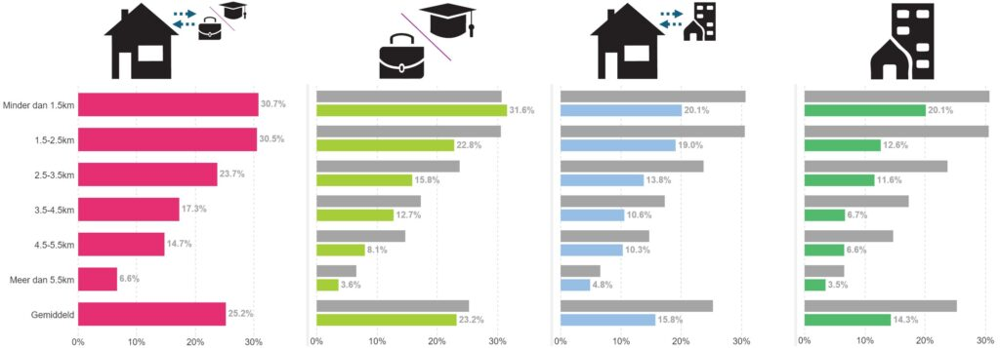
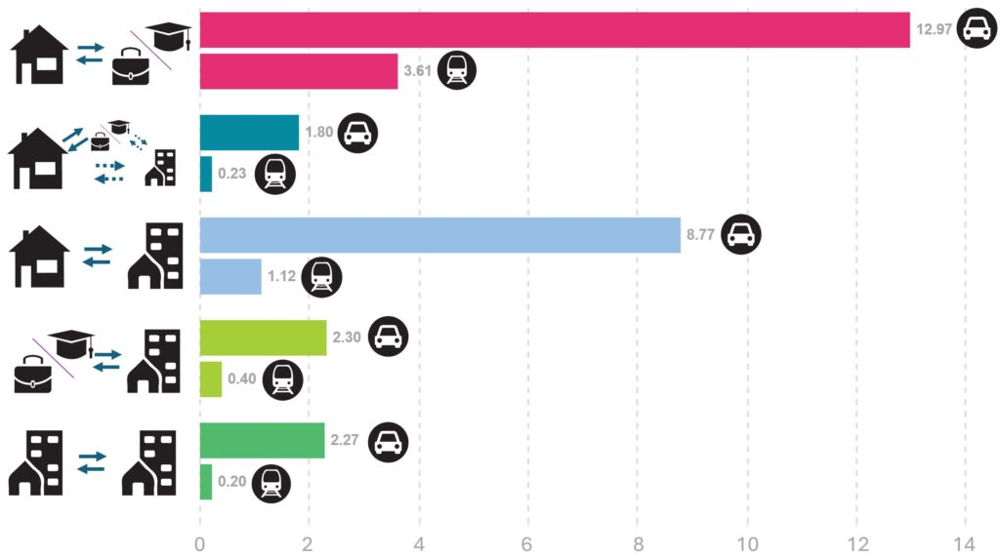

Nederlanders fietsen veel, maar buiten hun woonplaats ligt hun fietsgebruik 2 tot 4 keer lager. Dat is logisch, want buiten je woonplaats heb je vaak geen fiets. Wanneer mensen daar toch fietsen, dan is dit meestal met een 'tweede fiets'. Dat is een fiets die bijvoorbeeld op een station staat voor ritjes naar een bestemming waar je regelmatig heen gaat: je werk, studie, vriend(in) of familie. Een nadeel van tweede fietsen voor de samenleving is dat ze veel ruimte kosten in stationsstallingen. En voor de eigenaar is het nadeel dat je deze tweede fiets alleen kunt gebruiken in de stad waar hij staat, niet op andere plekken in Nederland waar je óók komt.

<h2>Met een deelfiets heb je overal een fiets</h2>

Een deelfiets is een oplossing om vaker buiten je woonplaats te kunnen fietsen. Een deelfiets is een fiets die niet van jou is, maar die je snel en gemakkelijk ergens huurt als je hem nodig hebt. Een bekend voorbeeld is de OV-fiets, maar er zijn meer aanbieders.

In de snelstudie <a href="https://web.archive.org/web/20251218232306/https://kennis.zuidholland.nl/wp-content/uploads/2024/11/Snelstudie_treingebruik_deelfietsaanbod-1.pdf" target="_blank" rel="noreferrer noopener">Effecten treingebruik bij verbeterd deelfietsaanbod op stations (pdf)</a> van Studio Bereikbaar is op basis van data-analyse gekeken naar groei van het treingebruik als er op meer stations deelfietsen te huur zouden zijn. Vier conclusies <em>(klik op ▶ om toelichting uit te klappen)</em>

1. In onze woonplaats fietsen we vier keer vaker dan als we op bezoek zijn in een andere stad. Meer deelfietsen op andere bestemmingen kunnen leiden tot een hoger fietsgebruik.

Dat is logisch: thuis heb je een eigen fiets. Hoe makkelijk zou het zijn als je op andere plaatsen een deelfiets kunt pakken voor het laatste stukje van het station naar je bestemming?

2. Vanaf huis fietsen mensen gerust 3 km naar het station maar mensen die op meer dan 1 km van het station werken neigen naar de auto voor hun hele reis (omdat ze niet de beschikking hebben over een fiets op het station).

Bij een afstand die te fietsen is – zeg anderhalve tot vijf kilometer – fietsen mensen vaker van huis naar hun vertrekstation dan van het aankomststation naar hun eindbestemming. Zo zien we bij een afstand van 3 tot 4 km tussen woning en vertrekstation een gemiddeld 2,5 keer hoger treingebruik dan als de bestemming op 3 tot 4 km van het aankomststation ligt.

3. Sommige treinreizigers zetten een 'tweede fiets' op een aankomststation bij hun werk of studie. Dat helpt om meer te fietsen, maar kost ruimte in stationsstallingen.

Dat inefficiënte gebruik komt doordat 'tweede fietsen' gemiddeld langer stilstaan in de stationsstalling: ze worden gemiddeld maar eens per 3,5 dag gebruikt (onderzocht door KIM).

4. Deelfietsen kunnen huren op meer bestemmingsstations leidt tot een derde meer treingebruik.

Als we op onze bestemming net zo makkelijk een fiets zouden kunnen pakken als thuis – bijvoorbeeld met deelfietsen op meer stations – dan groeit het gebruik van de trein 33 procent en daalt het gebruik van de auto 5 procent in Nederland. Dat geldt voor alle verplaatsingen van in totaal 10 kilometer en meer. Wat opvalt is dat maar 10 procent van die extra treinritten in de spits valt of naar stadscentra voert. De rest valt in de rustige uren en gaat naar de randen van de stad of kleinere plaatsen. Op die rustiger ritten en trajecten is er nog volop plek in de trein. Daar groeit het treingebruik met 40 tot 100 procent als er deelfietsen op meer stations komen. Deze groeicijfers gelden ook voor Zuid-Holland, blijkt uit de snelstudie.

Figuur 1 toont hoe de trein minder gebruikt wordt bij toenemende afstand tot het station. In de figuur is zichtbaar dat als een overige bestemming op 4 km van een station ligt, de trein slechts voor 6,7% van de gemaakte verplaatsingen gebruikt wordt. Dat is bijna 3 keer lager dan als de woning op 4 km van een station ligt, in welk geval gemiddeld 17,3% van de gemaakte reizen per trein wordt gemaakt.

<figure></figure>

<em>Figuur 1: Aandeel verplaatsingen per trein bij toenemende afstand tot een station. De afname in treingebruik bij toenemende afstand gaat veel sneller bij werk/studie en bij overige locaties (waar de fiets beperkt beschikbaar is), dan vanaf thuislocaties (waar de fiets goed beschikbaar is). Grijze balkjes bij rechter drie grafieken tonen de waarden voor thuislocatie (linkergrafiek) ter referentie. Bron: CBS-OViN 2016-2019, met daarin selectie op verplaatsingen langer dan 10 km.</em>

In aanvulling op het relatieve beeld in figuur 1, toont figuur 2 ook het absolute aantal verplaatsingen per weekdag, per type verplaatsing en per 100 inwoners, separaat voor de trein en de auto. Hierin is te zien hoe belangrijk elk type verplaatsing is per vervoerwijze (auto-als-bestuurder versus trein).

<figure></figure>

<em>Figuur 2: Aantal verplaatsingen per auto en per trein van langer dan 10 km, per weekdag, per 100 inwoners en per type verplaatsing. Respectievelijk: a) tussen woning en werk of studie, b) tussen woning en een overige locatie maar met een bezoek aan werk of studie tijdens de verplaatsingsketen, c) tussen woning en een overige locatie, d) tussen werk of studie en een overige locatie, e) tussen overige locaties onderling. Bron: CBS-OViN 2016-2019, selectie op verplaatsingen langer dan 10 km.</em>

<figure class="wp-block-media-text__media"></figure>

<h2>Totstandkoming</h2>

Deze snelstudie is door Studio Bereikbaar uitgevoerd in opdracht van de provincie Zuid-Holland (binnen het programma Kennis Zuid-Holland). De link naar de volledige studie: <a href="https://web.archive.org/web/20251218232306/https://kennis.zuidholland.nl/wp-content/uploads/2024/11/Snelstudie_treingebruik_deelfietsaanbod-1.pdf" target="_blank" rel="noreferrer noopener">Effecten treingebruik bij verbeterd deelfietsaanbod op stations (pdf)</a>.

