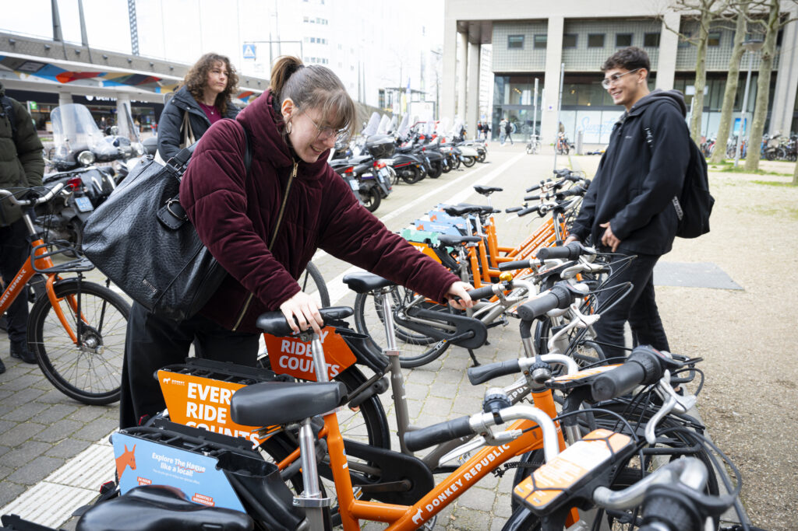

<blockquote class="wp-block-quote">
<cite><em>"Een kruising van een leasefiets (zoals Swapfiets) en een deelfiets (zoals OV-fiets)</em>. Een fiets die snel van baasje wisselt voor een vast bedrag per maand (en gratis is tijdens de proef. Doe je mee? Zie hieronder)".</cite>
</blockquote>

<h2>Staat niet lang stil op het station</h2>

<em>Wisselfietsen</em> zijn deelfietsen die maar kort stilstaan bij stations. De bedoeling is dat er mensen zijn die de <em>Wisselfiets</em> gebruiken van huis naar het station als eerste schakel voor een reis naar hun werk of opleiding. En dat er een andere groep mensen is die juist uit de trein stapt en de <em>Wisselfiets</em> voor het laatste stukje van de reis gebruikt. Op die manier staat de wisselfiets 's nachts nabij de woning van de eerste groep en overdag bij de bestemming van de tweede groep (werk of opleiding). Grote voordeel: De wisselfiets staat nauwelijks stil op het station.

<figure class="wp-block-media-text__media"></figure>

<h2>Voorbeeld</h2>

Sanne woont in Leiden en werkt in Den Haag. Ze fietst 's ochtends om 8 uur op een Wisselfiets van huis naar Leiden CS en springt daar in de trein naar Den Haag.

Een kwartiertje later stapt Lars uit op Leiden CS. Lars woont in Den Haag en werkt op het bio sciencepark in Leiden. Hij pakt de Wisselfiets voor de laatste 2 km naar zijn werk.

Na hun werkdag gaat het net omgekeerd. Lars fietst van zijn werk naar Leiden CS en pakt daar rond 17:30 de trein naar huis. Iets later komt Sanne weer aan op Leiden CS en fietst op de Wisselfiets naar huis. De wisselfiets staat in de ochtend en in de avond maar een kwartiertje stil op Leiden CS.

Frequent gebruik van een deelfiets zoals een OV-fiets kan al snel in de papieren lopen (OV-fiets = € 4,65 per keer). Daarom gebruiken forenzen en studenten niet vaak een OV-fiets maar zetten een 'tweede fietsje' of Swapfiets in de stalling bij het station waar ze uitstappen (uitzondering is als de baas betaalt). In de plaats waar je woont is de betalingsbereidheid nog lager (je hebt immers daar je eigen fiets al). We denken daarom dat het gebruik van de deelfiets in je woonplaats heel aantrekkelijk gemaakt moet worden. Je helpt het ruimteprobleem bij stations oplossen en krijgt tegelijkertijd voordelen zoals heel snel kunnen stallen op een mooie plek dicht bij de ingang van het station (en het is gratis tijdens de proef). Wellicht is de oplossing een maandabonnement waarmee je overal (ook in je woonplaats) een wisselfiets mag pakken. De prijs zou op het niveau van een <a href="https://swapfiets.nl/leiden" target="_blank" rel="noreferrer noopener nofollow">Swapfiets</a> kunnen liggen (€10 – €20 per maand). Als je mensen uitsluitend in hun woonplaats de Wisselfiets wilt laten gebruiken (omdat ze daarmee het stallingsprobleem oplossen) moet het wellicht gratis voor hen zijn of kan een extra incentive nodig zijn hen over te halen.

<h2>Doe je mee met de Wisselfiets-praktijkproef?</h2>

April tot september 2025 proberen we dit samen met oranje fietsen van Donkey Republic, die je gratis mag gebruiken. De praktijkproef is op:

<ul>
<li>Station Leiden CS</li>
<li>Station Den Haag CS</li>
<li>Den Haag Laan van NOI</li>
</ul>

Doe je mee? We zoeken circa 30 mensen per station die de fiets als voortransport gebruiken ('s ochtends van huis naar het station dus) én circa 30 mensen die de fiets als natransport gebruiken (dus 's ochtends van station naar je werk of opleiding). Studenten zijn van harte welkom om mee te doen.

<ul>
<li>Je fietst tenminste enkele keren per week van of naar een station waar de proef loopt.</li>
<li>Je fietst gratis en mag de oranje deelfietsen van Donkey ook in alle andere plaatsen gratis gebruiken als je dat wilt.</li>
<li>Je deelt je ervaringen met ons (per mail, app of brainstormsessie naar jouw keuze).</li>
<li>Actieve deelnemers krijgen af en toe een cadeautje als blijk van waardering.</li>
<li>Proef wordt georganiseerd door de Provincie Zuid-Holland (deelfiets@pzh.nl) in samenwerking met Zuid-Holland Bereikbaar, Deelfietsenbedrijf Donkey Republic, gemeente Den Haag, Katwijk, Oegstgeest en Leiden.</li>
</ul>

Doe je mee? Stuur een mail naar deelfiets@pzh.nl

<figure class="wp-block-media-text__media"></figure>

<h2>Verantwoording en links</h2>

De term Wisselfiets is vaker gebruikt, maar tot op heden niet doorgebroken. Rick (<a href="https://web.archive.org/web/20260302102719/https://www.linkedin.com/in/rick-aartman-395543193/" target="_blank" rel="noreferrer noopener nofollow">Stage Haagse Hogeschool</a>) en zijn begeleider Ronald Haverman zijn van mening dat de Wisselfiets een nieuwe kans verdient omdat de ruimte rondom station steeds schaarser wordt en Wisselfiets een bijdrage kan leveren aan de oplossing. Hieronder nemen we verwijzingen op naar Literatuur en proeven met Wisselfiets.

<ul>
<li><a href="https://www.volkskrant.nl/mensen/de-forensfiets-is-een-fiets-die-meer-fietst~b18f549e">De Forensfiets is een fiets die meer Fietst (Volkskrant 2008)</a></li>
<li><a href="https://web.archive.org/web/20260302102719/https://www.fietsersbond.nl/nieuws/ov-fiets-groeit-maar-door/">OV-fiets@Home is een proef die NS in 2012 deed.</a></li>
<li><a href="https://www.parool.nl/amsterdam/proef-met-wisselfietsen-op-station-zuid~be0471b5/">Proef met wisselfietsen op Station Adam Zuid (Parool 2019)</a></li>
<li><a href="https://openresearch.amsterdam/nl/page/67126/de-wisselfiets" target="_blank" rel="noreferrer noopener">De Wisselfiets – meer fietsen met minder fietsen (Vervoerregio Amsterdam, 2021)</a></li>
<li>De bijdrage van de wisselfiets bij het verminderen van parkeerdruk in fietsenstallingen (Stein van der Voort 2021)</li>
<li>Meer fietsen met minder fietsen in Leiden, Plan van Aanpak &amp; PvE (Mobicon iov Provincie Zuid-Holland, 2021)</li>
</ul>

