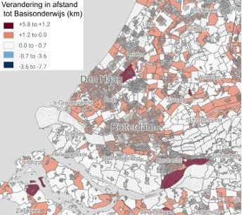
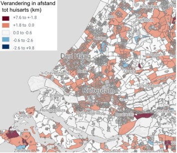
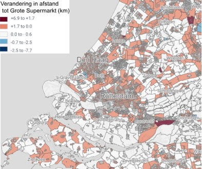

# Zorg voor voorzieningen dichtbij

Een pleidooi om de trend van het vergroten van afstanden te doorbreken.

Decennialang hebben schaalvergroting en centralisatie (van voorzieningen zoals winkels, gezondheidszorg) en het scheiden van wonen en werken ervoor gezorgd dat mensen vaker en verder moesten gaan reizen. Dat proces gaat nog steeds door, versterkt door een toename van autobezit en digitalisering (waaronder internetwinkelen). De mobiliteitssector heeft de gevolgen hiervan altijd opgevangen door te zorgen dat steeds meer mensen zich sneller kunnen verplaatsen (bijvoorbeeld door het aanleggen van wegen en uitbreiding van OV).

Het wordt echter steeds lastiger om dit op te vangen met extra infrastructuur omdat ruimte en geld voor nieuwe infra zeer schaars zijn en omgevingsfactoren steeds belangrijker worden. Bovendien is veel infra (zoals bruggen) aan groot onderhoud toe wat de komende jaren voor veel kosten, hinder en files gaat zorgen. Tel daarbij op dat het door bevolkingsgroei en grootschalige woningbouw steeds drukker wordt in Zuid-Holland, en de noodzaak voor verandering is duidelijk. De beweging van centralisatie en verbeteren van wegen is een cirkel die zichzelf versterkt.

Daarom wordt steeds meer gesproken over nabijheid (van voorzieningen, werk en goed OV) als alternatief voor uitbreiding van infrastructuur. Door bestemmingen dichterbij te brengen hoeven bewoners minder ver te reizen, lopen ze vaker, fietsen ze meer en pakken ze vaker het OV. Dat schept voor anderen weer ruimte om soepel met de auto te reizen over wegen die niet overvol zitten. De inzet op actieve mobiliteit en meer ruimte voor het leven in de nabijheid wordt bovendien gevraagd vanuit de zorgsector, ter voorkoming van beweegarmoede, eenzaamheid en het naderende 'zorginfarct' (waardoor zorg op termijn onbetaalbaar wordt). Met voorzieningen dichtbij gaan mensen elkaar weer meer ontmoeten wat kan leiden tot beter onderling begrip en daarmee vermindering van polarisatie.

Het gaat erom de trend van steeds grotere afstanden te keren en te kijken hoe we samen kunnen zorgen voor voorzieningen dichtbij huis, in de wijk, stad of regio. Dit is hét moment: met een [enorme woningbouwopgave (248.000 woningen tot 2030)](https://www.zuid-holland.nl/onderwerpen/ruimte/verstedelijking/), de nieuwe [Ruimtelijke koers](https://www.zuid-holland.nl/publish/besluitenattachments/aanbiedingsbrieven-van-ruimtelijk-voorstel-aan-partners/ruimtelijk-voorstel-ruimtelijke-koers-voor-zuid-holland-6-maart-2024.pdf) en de [Ruimtelijk Economische Visie 2025-2050](https://www.zuid-holland.nl/publish/pages/34745/ruimtelijk_economische_visie_2025-2050.pdf) gaat Zuid-Holland de komende jaren flink op de schop. Dat biedt kansen om in verschillende gebieden samen te werken aan meer nabijheid. Kansen liggen er niet alleen bij nieuwbouw, maar ook voor meer nabijheid in bestaande wijken.

Daarom pleiten we ervoor om fundamenteel anders naar bereikbaarheid te kijken: Niet langer alleen een mobiliteitssector die het maar op moet lossen met meer en snellere infrastructuur, maar een breed maatschappelijk debat over een toekomstbestendige ruimtelijke ordening en over planologische, economische en fiscale mogelijkheden voor nabijheid (waarin mobiliteit niet de sluitpost van beleid is).

Goede bereikbaarheid van voorzieningen moet niet afgewenteld worden op de mobiliteitssector

We realiseren ons dat de mobiliteitsmensen vaak niet aan de lat staan voor de ruimtelijke ordening, maar dat anderen (departementen, gemeentelijke afdelingen) hier belangrijke spelers zijn die voor een koerswijziging zouden kunnen zorgen. Het is dan ook een oproep aan mobiliteitsmensen om niet lijdzaam toe te zien hoe steeds onmogelijkere mobiliteitsopgaven op hun bordje worden geschoven, maar om het brede maatschappelijke debat aan te zwengelen dat een slimme (steden)bouw en ruimtelijke ordening cruciaal zijn om Zuid-Holland bereikbaar te houden.

<figure class="fig">
  
  <figcaption>de Heerenstraat in Lisse, waar nabijheid goed werkt.</figcaption>
</figure>

<figure class="fig">
  
  <figcaption>een winkelcentrum in Vlaardingen, waar de ruimte wordt bepaald door parkeerplaatsen.</figcaption>
</figure>

## Snelstudie: Zorg voor voorzieningen dichtbij

Deze snelstudie hoort bij het pleidooi, lees dat eerst. We gaan hier nader in op de oorzaken en gevolgen van het gebrek aan nabijheid en waarom de afwenteling op mobiliteit juist nú vastloopt (hoofdstuk 1). Ook beschrijven we oplossingsrichtingen (de 'knoppen' waaraan gedraaid kan worden, hoofdstuk 2). Die we vervolgens proberen toe te passen op concrete voorbeelden (hoofdstuk 3). In hoofdstuk 4 werken we het pleidooi - Zorg voor voorzieningen dichtbij en doorbreek de trend van het vergroten van afstanden - uit in aanbevelingen.

## 1. Verdwijnen nabijheid: Oorzaken en gevolgen

### Bereikbaarheid verslechtert door centralisatie

De afgelopen zestig jaar zijn we door centralisatie, efficiëntie-denken en het scheiden van functies (zoals wonen, werken, recreëren en leren) steeds verder uit elkaar gedreven. De gemiddelde afstand tussen woningen en voorzieningen is enorm gegroeid. We hebben veel (snel)wegen aangelegd om onze bestemmingen toch vlot te bereiken, terwijl er landelijk 40.000 kilometer aan wandelpaden is verdwenen. De laatste jaren zie je een toenemende belangstelling om dit om te draaien, waarbij de term nabijheid naar boven komt: we moeten voorzieningen dichter bij de mensen brengen.

Maar dat lukt vaak nog niet, en het zorgt voor een afwenteling op mobiliteit. Ligt de voorziening ver weg, dan is het aan de mobiliteitssector om deze op een goede manier te ontsluiten: met een bredere weg, een nieuwe busverbinding of een extra tramlijn. Dat maakt de voorziening beter bereikbaar, ondanks de grote afstand. Bovendien maakt de verbeterde infrastructuur het mogelijk om verder weg te wonen/werken/recreëren zonder aan reistijd te verliezen. Dat maakte schaalvergroting mogelijk waarbij meer mensen met dezelfde reistijd grotere voorzieningen konden bereiken. Het verdwijnen van kleinschalige voorzieningen is hiervan (deels) het gevolg. En zo zitten we in een cirkel van groter wordende afstanden en betere infrastructuur. Een cirkel die zichzelf versterkt. Dat tij moeten we keren.

En het dreigt vast te lopen: het wordt steeds drukker door enorme woningbouw, terwijl de infra slechter presteert door de slechte staat en onderhoudswerkzaamheden. We moeten dus slimmer omgaan met de plaatsing van voorzieningen, zodat er minder druk op mobiliteit en infrastructuur komt.

**Trend 1: Nabijheid is verloren gegaan.** Ervoor zorgen dat de meeste voorzieningen voor het dagelijks leven (winkels, scholen, artsen, kroegen, werkplekken, ontmoetingsplekken en woningen) dicht bij elkaar liggen, is steeds lastiger geworden. Voor veel van die voorzieningen moet je vanuit je woning nu behoorlijke afstanden afleggen.

**Trend 2: Functiemenging is verloren gegaan.** Het combineren van functies lijkt heel moeilijk geworden. Kijk maar naar een oude foto van een wijk: winkels, woningen, een paar bedrijfjes, een kroeg, alles door elkaar. Er worden zeker nog ontwerpen gemaakt voor gemengde wijken, maar ze worden nauwelijks gerealiseerd. Er zijn pleidooien voor functiemenging, maar in de praktijk blijkt het ingewikkeld.

**De samenhang van functiemenging en nabijheid.** De twee hangen samen: met meer functiemenging krijg je meer nabijheid, en als je nabijheid tot belangrijk doel maakt, leidt dat vaak tot functiemenging. Om dit echt te veranderen, moeten we de achterliggende oorzaken begrijpen. Hieronder schetsen we zes oorzaken die hierin een sterke rol spelen.

### De oorzaken

1. **De dominante ruimtelijke visie.** In Nederland kennen we een sterke scheiding van functies, waardoor er nauwelijks nog gemengde buurten ontstaan. Waar het vroeger logisch was dat een vervuilende fabriek niet naast een woonwijk kwam, geldt dat voor veel hedendaagse bedrijvigheid, zoals kantoorwerk en mkb-activiteiten, helemaal niet. In plaats van alle bedrijven eerst te verplaatsen om een woonwijk te ontwikkelen, kan ook gekeken worden welke bedrijven prima kunnen blijven staan.

2. **Toename van schaal.** Om functies echt te kunnen mengen, wil je idealiter dat de bedrijven tussen de woningen niet te groot zijn. Maar de afgelopen 20–30 jaar worden veel voorzieningen juist groter. Kleine ziekenhuizen worden vervangen door megaziekenhuizen, huisartsen in de buurt door grotere posten op afstand, en kleine winkels bestaan vrijwel alleen nog in het speciale segment terwijl supermarkten steeds groter worden. Dit komt veelal door het economisch denken: een grotere voorziening is puur economisch vaak goedkoper en efficiënter. Maar de externe gevolgen, zoals grotere reisafstanden, extra investeringen in mobiliteit en de bijbehorende uitstoot, worden niet meegerekend.

3. **Grote investeringen in infrastructuur.** Zoals hierboven beschreven stimuleert goede en snelle infrastructuur centralisatie van voorzieningen. Mensen kunnen met hetzelfde gemak grotere afstanden afleggen. Hierdoor zorgen de verbeteringen aan de infra juist ook voor verschraling van lokale voorzieningen.

4. **Vrijheid.** We koesteren keuzevrijheid: van ondernemers die voor grote locaties langs de snelweg kiezen, en van jonge artsen die zich door vrije vestiging neerzetten waar al veel huisartsen zijn (wat tot tekorten leidt in bijvoorbeeld Zeeland). En de vrijheid van ons allen: door de dominantie van de auto bouwen zelfs natuurorganisaties enorme parkeerplaatsen bij bezoekerscentra, terwijl de bushaltes minder aandacht krijgen.

5. **De invloed van normen.** Er zijn veel afstands- en ruimtegebruik standaarden. Parkeernormen hebben een sterk sturend effect: een hoge parkeernorm kleurt automatisch een ruimtelijk ontwerp, zo werd in Leidsche Rijn veel groen opgeofferd voor een parkeernorm hoger dan 1,0. Daarnaast zijn er veel hinderregels, waardoor bedrijven altijd op afstand van woningen geplaatst moeten worden. Deze richtlijnen zorgen ervoor dat maar weinig functies echt in de buurt, laat staan in woonwijken, terechtkomen.

6. **De bestuurlijke terughoudendheid.** Het mengen van functies vraagt iets meer van bewoners en bedrijven; ze moeten meer rekening met elkaar houden. Dat is ook waarom veel gemeenten er, in ons gepolariseerde landschap, niet eens aan beginnen: het is "moeilijk en veel gedoe, met veel klagende bewoners", hoewel het vaak betere oplossingen voor de toekomst oplevert.

**Twee onderliggende thema's.** De eerste vier oorzaken wortelen vooral in economische prioritering en marktdynamiek: schaalvoordeel, keuzevrijheid en kostenefficiëntie krijgen stelselmatig voorrang boven nabijheid, ook wanneer dat op de lange termijn duurder uitpakt. De laatste twee zitten vast in conventionele planningsprocedures en bestuurlijke gewoonten die verandering afremmen. Beide sporen wijzen naar dezelfde kern: een dominant economisch korte termijn perspectief overheerst in de ruimtelijke ordening, ook in de instrumenten die juist bedoeld zijn om dat te corrigeren.

### De gevolgen

Deze zes oorzaken werken door in de fysieke en sociale werkelijkheid van Zuid-Holland. Zes gevolgen springen eruit, waarbij de rode draad is het verliezen van kleinschalige voorzieningen en ontmoetingsmogelijkheden in dorpen en wijken.

1. **Verspilling van ruimte.** Sinds 1950 is de bevolking van Zuid-Holland met 40% toegenomen, van 2,5 naar 3,5 miljoen. Het bebouwde oppervlak groeide in diezelfde periode tien keer zo hard: van circa 5% naar 25% van het grondoppervlak, een toename van 400%. Dit komt door autogerichte woon- en werkomgevingen, functiescheiding, vrijstaande en uitgebreide laagbouw, en bedrijventerreinen die door hindercontouren veel ruimte innemen. Als we zo doorgaan, blijft er weinig ruimte over in Zuid-Holland en moeten keuzes worden gemaakt zoals beschreven is in [de Ruimtelijke Koers van Zuid-Holland](https://www.zuid-holland.nl/onderwerpen/ruimte/ruimtelijke-koers/).

2. **Monotone slaapwijken en -steden.** Er zijn veel woonwijken gecreëerd waar weinig tot niets gebeurt. Winkels zitten in geïsoleerde winkelcentra in plaats van in levendige dorpskernen en er is geen café, gemeenschappelijk (buurthuis, bibliotheek) of werkbestemming te vinden. Aan de andere kant liggen bedrijvenparken geïsoleerd. Slecht bereikbaar voor (jonge) medewerkers die niet met de auto kunnen of willen komen. Kantoren die 's avonds en in het weekend zo leeg zijn dat het onveilig aanvoelt.

3. **Steeds grotere afstanden.** Door onze ruimte zo in te delen, moeten er altijd grote afstanden worden overbrugd. De sportvelden liggen 6 kilometer links, de supermarkt 2 kilometer rechts, het ziekenhuis steeds verder weg, en natuurgebieden zijn nauwelijks met het OV bereikbaar. Voor een mooie mix van functies kun je vrijwel alleen nog naar het stadscentrum.

4. **Afwenteling op mobiliteit.** Door de ruimte zo te organiseren worden keuzes van anderen (schoolbesturen, huisartsenposten, ziekenhuizen, winkelketens) steeds opnieuw afgewenteld op de mobiliteitssector: voor bijna elke voorziening moet je grotere afstanden afleggen, meestal met de auto.

5. **Verlies van sociale samenhang.** Dit speelt op twee niveaus. Bestuurlijk hoeven de verantwoordelijken voor losse functies (school, zorg, detailhandel, wonen) zonder functiemenging weinig met elkaar af te stemmen; iedereen blijft in zijn eigen domein. Voor bewoners betekent het vooral minder reuring: zonder gemengde, levendige wijken ontstaat er minder toevallige ontmoeting en daarmee minder ruimte voor sociale cohesie.

6. **Ongelijk verdeelde gevolgen.** Verminderde nabijheid raakt niet iedereen even hard. Vooral mensen die minder goed zelfstandig grote afstanden kunnen overbruggen, zoals jongeren zonder rijbewijs, ouderen die willen stoppen met autorijden, en de circa 20% van de volwassenen zonder rijbewijs, ondervinden de grootste hinder. Het is dus niet per se een kwestie van inkomen, maar van mobiliteitsvermogen: wie zelfstandig geen auto kan of wil gebruiken, is het kwetsbaarst voor groeiende afstanden.

### Afwenteling op mobiliteit: niet meer haalbaar

De bovenstaande oorzaken zorgen ervoor dat, ondanks goede intenties om voorzieningen nabij te plaatsen, mobiliteit telkens de reistijd moet verkorten in plaats van dat de voorziening daadwerkelijk dichtbij komt. Echte nabijheid is daarom veel minder een mobiliteitsvraagstuk; ze vindt haar oorsprong in ons economisch systeem en in de ruimtelijke ordening.

Zolang er genoeg geld was, konden we die afwenteling veroorloven. Je loste immers op wat anderen veroorzaakten, en je werd er nog populair van ook: vaak werd het niet eens als afwenteling gezien, maar als "de normale loop van het leven". Maar die tijd is voorbij. Het is niet alleen het geld dat op is, ook de ruimte is op. Het past simpelweg niet meer. Met scherpe keuzes alleen komen we er niet; we zullen de rekening ook niet langer eenzijdig bij mobiliteit moeten neerleggen.

Dat dit een fundamenteel patroon is, laat de Amerikaanse beweging Strong Towns zien (Charles Marohn, *Confessions of a Recovering Engineer*). Haar kernpunt is de financiële onhoudbaarheid van het eindeloos aanleggen van infrastructuur, juist waardoor nabijheid afneemt. De les: stop je geld in de plekken waar de mensen zijn en waar het leven zich afspeelt, de centra van steden waar je nabijheid creëert, in plaats van in het steeds maar uitbreiden van netwerken. In de Verenigde Staten en Frankrijk speelt dit op grotere schaal en is de infrastructuur niet meer te bekostigen; ook in Zuid-Holland bewegen we die kant op, met steeds minder geld voor het onderhoud van bestaande infrastructuur.

## 2. Mogelijkheden voor het verbeteren van nabijheid

<figure class="fig fig--rechts fig--smal">
  
</figure>

Hoofdstuk 1 bracht in kaart waarom nabijheid creëren zo moeilijk is. In dit hoofdstuk kijken we hoe we het kunnen omdraaien. We doen dat met een set knoppen waaraan gedraaid kan worden om nabijheid op een structurele manier te realiseren. Elke knop vraagt actie uit een andere hoek. Juist dat laat zien dat echte nabijheid niet alleen werk is voor de mobiliteitssector, maar voor een hele groep sectoren.

Belangrijk hierbij is te erkennen dat de overheid vaak maar beperkte sturing hierop heeft. Verschillende overheden die goed samenwerken kunnen al iets beter sturen, maar het stimuleren van initiatieven van onderaf is cruciaal om te zorgen voor voorzieningen dichtbij. Waar de overheid effectief kan zijn is in initiatieven ondersteunen. Dat zit hem minder in sterk sturen en plannen, maar in het scheppen van de juiste voorwaarden zodat het dorp/kern/wijk in zijn eigen vitaliteit gaat voorzien onder veranderende omstandigheden.

Voor de invulling putten we mede uit de gids ["Sturen op voorzieningen: van afstand naar nabijheid"](https://vervoer-voor-elkaar.nl/wp-content/uploads/2026/05/NM-Sturen-op-voorzieningen-DEF.pdf) van Natuur & Milieu (april 2026), die tien concrete maatregelen beschrijft waarmee gemeenten voorzieningen dichtbij houden. Die gids onderscheidt ook vijf rollen die een gemeente per maatregel kan innemen: reguleren (voorschrijven of verbieden), faciliteren (voorwaarden scheppen), verbinden (initiatieven herkennen en samenbrengen), realiseren (zelf de voorziening opzetten of beheren) en communiceren (informeren over ambitie en beleid).

De knoppen in de toolkit:

1. Besluitvorming rond voorzieningen (school, huisarts, ziekenhuis, supermarkt)
2. Ruimtelijke ordening: sturen op gemengde wijken, parkeren, echte hinder, en een richtinggevende ruimtelijke koers.
3. Economische regelingen: versterken van de positie van het midden- en kleinbedrijf
4. Mobiliteit: STOMP als sluitstuk.
5. Financiële doorrekening: bereken de totale maatschappelijke kosten en baten. Nabijheid is financieel heel gunstig als je kijkt naar totale maatschappelijke kosten en baten.
6. Overig: ontmoetingsplekken, multifunctioneel en gedeeld gebruik, en onderzoek naar wat mensen echt nabij willen.

### 2.1 Besluitvorming van voorzieningen

We kijken eerst hoe de besluitvorming over voorzieningen verloopt, en hoe die het in stand houden van nabijheid bemoeilijkt. Want veel voorzieningen die wegtrekken, komen niet zomaar terug. Aan de hand van enkele voorbeelden schetsen we de rol van besluitvorming en regelgeving.

Een concreet hulpmiddel om te bepalen of voorzieningen daadwerkelijk dichtbij genoeg zijn, is de acceptabele reistijd: hoe lang zijn mensen bereid te reizen naar een voorziening, per vervoerswijze? Onderzoek van het Kennisinstituut voor Mobiliteitsbeleid (KiM) geeft hiervoor de volgende richtwaarden, in minuten en afgerond op 5 minuten:

| Voorziening | Auto | Fiets | OV | Lopen |
|---|---|---|---|---|
| Supermarkt | 10 | 10 | 15 | 15 |
| Huisarts | 10 | 15 | 20 | 15 |
| Ziekenhuis | 20 | 25 | 30 | 20 |
| Middelbare school | 15 | 25 | 30 | 25 |
| MBO | 25 | 25 | 40 | 25 |
| HBO/WO | 35 | 25 | 45 | 15 |
| Arbeidsplaatsen | 35 | 30 | 50 | 20 |
{: .table-container}

Ligt de daadwerkelijke reistijd boven deze richtwaarden, dan is een voorziening voor veel inwoners feitelijk te ver weg. Dit biedt gemeenten een objectieve maatstaf om per wijk of dorp te bepalen waar de nabijheid het hardst onder druk staat, complementair aan de voorbeelden hieronder.

#### 2.1.1 De basisschool.

<figure class="fig fig--rechts">
  
  <figcaption>Kaart 1: De verandering in de afstand tot basisonderwijs in kilometers tussen het jaar 2017 en 2025, in de provincie Zuid-Holland.</figcaption>
</figure>

Een basisschool is belangrijk voor een gemeenschap en wordt door het Rijk gefinancierd. Deze financiering is gekoppeld aan het aantal leerlingen, daalt dat aantal dan daalt de financiering; onder de instandhoudingsnorm (in de kleinste gemeenten 23 leerlingen) stopt de bekostiging. Het probleem is dat veel scholen al veel eerder sluiten, mede doordat besturen handelen vanuit eigenbelang in een systeem dat concurrentie op leerlingenaantallen stimuleert. Bovendien is voor een nieuwe school een minimum van 200 leerlingen nodig. Eenmaal weg, komt een school niet snel terug. In kaart 1 hieronder kun je goed zien hoe deze verandering zich voordoet in de praktijk. Waarbij je duidelijk ziet dat tussen het jaar 2017 en 2025 de gemiddelde afstand tot basisonderwijs in een groot deel van Zuid-Holland is toegenomen.

#### 2.1.2 De huisarts.

<figure class="fig fig--rechts">
  
  <figcaption>Kaart 2: De verandering in de afstand tot huisartsenposten in kilometers tussen het jaar 2017 en 2025, in de provincie Zuid-Holland.</figcaption>
</figure>

Steeds meer praktijken zitten vol en nemen geen nieuwe patiënten meer aan, terwijl in landelijke gebieden juist huisartsen verdwijnen en mensen verder moeten reizen. Er wordt vaak gesproken over een tekort. Een andere belangrijke oorzaak is het gebrek aan (betaalbare) praktijkruimte. Dat gebrek aan betaalbare praktijkruimte houdt verband met dure vastgoed- en woningprijzen. In kernen kan met overheids inzet wel degelijk een positieve invloed uitgeoefend worden, bijvoorbeeld door goede en betaalbare (multifunctionele) praktijkruimtes. Ook hier kan het anders nadenken over plaatsing, de nabijheid vergroten en het aantal vervoersbewegingen verminderen.

#### 2.1.3 De supermarkt.

<figure class="fig fig--rechts">
  
  <figcaption>Kaart 3: De verandering in de afstand tot een supermarkt in kilometers tussen het jaar 2017 en 2025, in de provincie Zuid-Holland.</figcaption>
</figure>

De vestiging van supermarkten is primair een commerciële aangelegenheid: ketens en ontwikkelaars kiezen hun locatie op basis van bevolkingsdichtheid, koopkracht en concurrentie. De gemeente speelt vooral een reactieve, vaak restrictieve rol via het omgevingsplan. In stedelijke gebieden is er meestal genoeg animo; de problemen zitten in landelijke gebieden, waar de buurtsuper verdwijnt. Door stijgende kosten en concurrentie van grote ketens is kleinschalige exploitatie steeds minder rendabel (ook gebrek aan bedrijfsopvolging speelt een rol). [Tussen 2012 en 2023 daalde het aantal kleine supermarkten van 1.022 naar 622](https://www.cbre.nl/insights/reports/de-online-toekomst-van-boodschappen) (CBRE, 2023). In 2023 had nog maar 30% van de woonplaatsen met minder dan vijfduizend inwoners een supermarkt, tien procentpunt minder dan twintig jaar eerder.

#### 2.1.4 Het ziekenhuis.

Ook bij ziekenhuizen zie je centralisatie, vaak onder het mom van specialisatie. Grotere voorzieningen kunnen gespecialiseerde zorg voordeliger aanbieden, maar de centralisatie zorgt er wel voor dat veel zorg steeds verder weg komt te liggen, en vooral met de auto bereikbaar is. Voor huishoudens zonder auto is er weinig aandacht. [Het PBL (2024)](https://www.pbl.nl/publicaties/beter-bereikbaar) vergeleek 2012 met 2022: "In 2022 is de autobereikbaarheid van ziekenhuizen licht afgenomen in landelijke buurten, maar nog steeds kunnen vrijwel alle ouderen met de auto meerdere ziekenhuislocaties of buitenpoliklinieken bereiken. Per openbaar vervoer daarentegen is het aandeel ouderen met een laag huishoudinkomen dat geen enkel ziekenhuis of buitenpolikliniek binnen 45 minuten kan bereiken met 4 procentpunt gestegen, tot 13 procent van alle ouderen (215.700 ouderen)."

#### 2.1.5 Onderwijs: het Utrecht Science Park.

Wat bij woningbouw al lastig is, geldt nog sterker voor een grote instelling. Het Utrecht Science Park (de voormalige Uithof) werd decennia geleden aan de oostrand van Utrecht geplaatst, met weinig eromheen. Dat trok zoveel mensen op dezelfde tijdstippen naar één plek dat de buslijn ernaartoe een van de drukste van Europa werd, en het ontlasten ervan vroeg om een nieuwe tramlijn van €515 miljoen, ruim boven het budget van €312 miljoen (NRC via DUB). Eén locatiebesluit kan het mobiliteitssysteem dus decennialang een probleem bezorgen. Het laat zien hoe belangrijk het is om grote instellingen te plaatsen waar mensen ze makkelijk kunnen bereiken, en die kosten vooraf mee te wegen in plaats van ze door te schuiven.

#### 2.1.6 Postorderbedrijven.

Kleinbedrijf is op veel plekken vervangen door grootbedrijf op bedrijventerreinen, en de nabijheid ervan is afgewenteld op de mobiliteit via gigantische logistieke centra en bezorgdiensten. Kleinbedrijf kan hier nauwelijks mee concurreren. Pakketmuren zijn een verlengstuk van deze internet- en postorderbedrijven, die de nabijheid nog verder bemoeilijken.

#### Hoe kunnen we de besluitvorming verbeteren?

Dit zijn slechts enkele voorbeelden. Om echt te veranderen waar en hoe voorzieningen geplaatst worden, moet per voorziening worden gekeken hoe het best gestuurd kan worden. Kort samengevat: schoolbesturen stimuleren om naar de regionale opgave te kijken in plaats van naar individuele belangen, en het financieringsmodel herzien zodat het samenwerking bevordert in plaats van concurrentie; voor huisartsen zoeken naar een rechtvaardige spreiding van praktijken; bij grote instellingen en ziekenhuizen beter kijken naar bereikbaarheid óók zonder auto; en bij supermarkten en ander kleinbedrijf kleinere winkels en initiatieven ondersteunen zodat ze kunnen blijven bestaan ([LVM-notitie "De waarde van nabijheid voor mens en klimaat"](https://labverantwoordemobiliteit.nl/notities/de-waarde-van-nabijheid-voor-mens-en-klimaat/)). De provincie Zuid-Holland zegt wel vaak "Eerst bewegen en dan pas bouwen", maar niet duidelijk is welke consequenties dat in de praktijk heeft.

### 2.2 Ruimtelijke ordening

Een groot deel van de geschetste problemen hangt samen met het ontbreken van een richtinggevende en inspirerende ruimtelijke ordening. Besluitvormers denken vaak dat als het bedrijfseconomisch kan, de locatie secundair is; tegelijk zijn we huiverig geworden voor functiemenging. Goede ruimtelijke ordening gaat uit van het idee "alles kan, maar niet alles kan overal", en streeft tegelijk naar menging van functies waar dat kan. Dat vraagt om afgewogen plannen en bestemmingen. We willen niet terug naar de ruimtelijke ordening van de jaren negentig, maar zien wél de waarde en de noodzaak van het maken van ruimtelijke plannen.

#### 2.2.1 Sturen op gemengde wijken (functiemenging).

Nabijheid hangt sterk samen met sturen op functiemenging en het beperken van schaalvergroting. Vaak is de intentie er wel, maar leidt het niet tot realisatie. Door woningen en voorzieningen te combineren, voorkom je dat wijken puur uit woningen bestaan en alle bedrijvigheid op een industrieterrein belandt. In de uitvoering zitten enkele obstakels; de belangrijkste knoppen:

- **Verbied nieuwe "woonwijk"-bestemmingen; bestem nieuw gebied standaard als "gemengd gebied".** Dit is een eenvoudige stap met grote gevolgen: de bestemming bestaat al, maar wordt buiten de steden nauwelijks nog toegepast. Het zal weerstand oproepen, maar geeft helderheid en beperkt speculatie.
- **Behoud bedrijfsbestemmingen; verbiedt omzetting naar 100 % wonen.** Schaarste aan bedrijfsruimte jaagt huurprijzen op en verkleint de kans op nabijheid.
- **Verbied het samenvoegen van winkelpanden voor grootbedrijven** en biedt geen ruimte voor grootbedrijf in nabijheidslocaties.
- **Maak kleinschalige werkbestemmingen in nieuwbouwwijken** en creëer flexibele bedrijfsruimte op de begane grond onder woningen, die kan meegroeien en krimpen met de vraag. Zorg voor flexibele werkplekken zoals beschreven in ["Snelstudie: dicht bij huis werken in de 'Thuiswerkhub'"](https://www.zuid-holland.nl/actueel/kennis-zuid-holland/onderzoeken-1/overzicht-onderzoeken/snelstudie-dicht-huis-werken-thuiswerkhub/)
- **Zorg dat in diezelfde gemengde bestemming ook ruimte is voor niet-commerciële activiteiten**, bijvoorbeeld via een dorpshuis, buurthuis of multifunctionele accommodatie waarin meerdere maatschappelijke voorzieningen worden gecombineerd.
- **Verplicht bouw van woon-werk- en praktijk-aan-huis-woningen** in nieuwbouwplannen.

#### 2.2.2 Beter kijken naar de echte hinder.

Functiemenging kan alleen als functies daadwerkelijk bij elkaar mogen. Juist hier gaat het vaak al mis: om hinder (geluid, verkeer, geur, gevaar) te voorkomen, zijn richtlijnen ontwikkeld die bedrijven op afstand van woningen houden. Op zich een goed systeem, maar in veel gevallen is de hinder helemaal niet zo groot, denk aan lichte bedrijvigheid zoals ambachten, kantoor- en dienstverlenende functies. Bovendien zorgt de op diensten gerichte economie, samen met verduurzaming en digitalisering, ervoor dat steeds meer bedrijven minder hinder veroorzaken. Doordat de richtlijnen als harde leidraad worden genomen, ontwikkelen woningbouwers niet snel binnen de hindercontouren, en blijft maatwerk achterwege. Het gevolg: veel moeite, tijd en geld gaat zitten in het uitplaatsen van bedrijven, om er vervolgens monofunctionele wijken te bouwen. Door flexibeler met de hindercontouren om te gaan, kunnen we makkelijker wonen en werken dichtbij elkaar brengen.

#### 2.2.3 Sturen op dichtheid met de parkeernorm.

Het aantal parkeerplekken beïnvloedt de nabijheid sterker dan het lijkt: ze nemen veel ruimte in. Een hoge parkeernorm zorgt voor lagere dichtheden en minder draagvlak voor voorzieningen. Het stimuleert autogebruik, maakt schaalvergroting en centralisatie mogelijk en vraagt om meer infrastructuur. Lagere parkeernormen in combinatie met een goede OV-verbinding maken juist ruimte vrij voor voorzieningen: ruimte die normaal naar parkeren en auto-infra gaat, kan dan gebruikt worden om meer woningen te bouwen, wijken anders in te richten, met voorzieningen dichterbij en meer bestemmingen om naartoe te lopen en te fietsen.

#### 2.2.4 Een richtinggevende ruimtelijke koers (een "streekplan nieuwe stijl").

Veel van het bovenstaande vraagt om samenhang op een hoger schaalniveau. Het oude streekplan is verdwenen (de term kent bijna niemand meer), maar de behoefte aan een richtinggevend, gebiedsgericht ruimtelijk plan is terug. In de praktijk ontstaat er met de ruimtelijke puzzel (gebiedsgericht, in vijf regio's) al iets wat op een modern streekplan lijkt. De opgave is om daarin nabijheid expliciet mee te nemen en helder te benoemen aan welke knoppen de provincie kan draaien. Niet als terugkeer naar vroeger, maar als instrument om functies en locaties weer in samenhang af te wegen.

#### 2.2.5 Vroeg aan tafel en de verordening.

Er zijn meerdere manieren om dit voor elkaar te krijgen. De sterkste hefboom zit aan de voorkant van het proces, en dat heeft twee kanten:

- **Zorg dat het gemeentelijk beleid vooraf goed is:** als het beleid al verkeerd staat, vecht je aan tafel tegen je eigen uitgangspunten in.
- **Zorg dat mobiliteit zelf eerder aan tafel komt in het ruimteproces**, bij de ontwikkelaars, en niet alleen bij de woningbouwopgave. Voor het eerst zit mobiliteit aan de voorkant in het ruimteproces voor woningbouw aan tafel; dat is precies de plek waar de invloed zit. Daar kun je vertellen dat er geen geld en geen ruimte meer is om de mobiliteit op de oude manier te faciliteren, en dat het anders moet.

Voor mobiliteit is dit ook een reden om zich actiever met de omgevingsverordening te bemoeien: omdat we willen dat ontwikkelaars en gemeenten doen wat vanuit mobiliteit nodig is, en dat nu via die weg georganiseerd moet worden. Vanuit hier kunnen concrete, planologische voorbeeld aanbevelingen worden uitgewerkt die in een verordening landen.

### 2.3 Regelingen om lokale voorzieningen en gemeenschapskracht te bevorderen

**Versterken positie midden- en kleinbedrijf.** Om nabijheid in een wijk te realiseren én te behouden, heb je vaak het midden- en kleinbedrijf nodig. Juist voor hen is het lastig het hoofd boven water te houden; vaak lukt het alleen speciaalzaken. Andere zaken vallen om, waarna het pand wordt omgebouwd tot woningen en de nabijheid alsnog afneemt. Creëer daarom een gelijk speelveld voor kleinbedrijf ten opzichte van grootbedrijf, op punten als: inkoopprijzen, digitalisering, huurprijzen, energieprijzen, belasting, personeel, financiering, openingstijden, aanbestedingen, beleidsinvloed, regeldruk en rechtsbescherming.

**Versterken 'gemeenschapskracht'.** Naast dit gelijke speelveld kunnen overheden ook financiering helpen organiseren voor kleinschalige initiatieven: door crowdfunding te faciliteren, zoals in Baambrugge, Ilpendam en Sauwerd, waar bewoners samen een buurtsuper overeind hielden, of door aan te sluiten bij Europese en Nederlandse fondsen zoals het LEADER-programma. De provincie Zuid-Holland heeft zich voorgenomen actiever te samenwerken met maatschappelijke initiatieven zoals buurtprojecten, energie gemeenschappen en sociale projecten en heeft [daar geld voor gereserveerd in de voorjaarsnota](https://pzh.notubiz.nl/document/17009545/1/Voorjaarsnota+2026?connection_type=16&connection_id=1170337).

### 2.4 Mobiliteit: Inzetten op alle vervoerswijzen

Ondanks dat we de afwenteling op mobiliteit willen tegengaan en nabijheid niet alleen vanuit een mobiliteitsperspectief willen benaderen, blijft mobiliteit een belangrijke rol spelen. Met voorzieningen dichtbij hoeven bewoners minder ver te reizen, lopen ze vaker, fietsen ze meer, pakken ze vaker het OV en verbetert hun bereikbaarheid. Door juiste lokale investeringen in het verhelpen van knelpunten voor lopers en fietsers kan de bereikbaarheid van voorzieningen dichtbij verder verbeterd worden.

### 2.5 Financiële doorrekening

Nabijheid levert veel maatschappelijke baten op, zoals een betere gezondheid (en daarmee vermeden zorgkosten en minder ziekteverzuim), meer sociale cohesie (doordat er meer mensen op straat zijn) en minder (CO2)-uitstoot. Deze baten zijn nog geen onderdeel van de huidige praktijk van gebiedsontwikkeling en het investeren in mobiliteit. Er wordt onder andere door de Rebel Group gerekend aan deze maatschappelijke baten; we kunnen dit al inpassen in de huidige praktijk.

Dat kan in de vorm van een maatschappelijke kosten-batenanalyse (MKBA), maar kan ook door naar de betalingsbereidheid van burgers te kijken. Deze methode wordt toegepast door Populytics. Bij een onderzoek dat Populytics voor de Metropoolregio Amsterdam heeft uitgevoerd bleek dat burgers veel meer dan bestuurders kiezen voor het investeren in nabijheid (wandelen, fietsen en groen).

### 2.6 Overig

- Creëer ontmoetingsplaatsen en multifunctionele ruimten (bijvoorbeeld bedrijfsverzamelgebouwen).
- Time-share van voorzieningen: markt, foodtrucks, of een wekelijks spreekuur van fysio of tandarts in een door de overheid gefaciliteerde ruimte. Zo neem je de vaste kosten weg die dienstverleners ervan weerhouden om bijvoorbeeld één dag per week lokaal aanwezig te zijn.
- Onderzoek naar wat mensen echt nabij willen hebben, zodat de juiste voorzieningen gestimuleerd kunnen worden.
- Multifunctionele accommodaties (MFA's): breng meerdere maatschappelijke voorzieningen (huisarts, fysiotherapie, bibliotheek, ontmoetingsruimte) fysiek samen in één gebouw op een centrale plek, zoals 't LaefHoês in America (gemeente Horst aan de Maas) of het Kulturhus in Holten. De gemeente faciliteert en verbindt; de exploitatie ligt meestal bij vrijwilligersorganisaties. Belangrijk is om juist ook ruimte te bieden aan ontmoetingen die niet commercieel van opzet zijn en een hoge huur kunnen betalen.
- Mobiele diensten: laat voorzieningen die te klein zijn voor een vaste vestiging op vaste dagen en plekken rondrijden, zoals de Tandartsbus, Food-trucks, de Biblioservicebus in Zeeland, of de SRV-wagen in West-Fryslân. De gemeente biedt veilige, goed bereikbare standplaatsen en snelle vergunningprocedures.
- Vrijwilligersvervoer: ondersteun vervoer door vrijwilligers voor wie voorzieningen niet zelfstandig kan bereiken, zoals De HugoHopper (Dijk en Waard) of Vervoer Houten. Dit is vaak een aanvulling op het Wmo-doelgroepenvervoer van de gemeente.

## 3. De toolkit toegepast

De toolkit uit hoofdstuk 2 biedt principes om voorzieningen dichterbij te brengen en langzamere, duurzamere vervoerwijzen te bevorderen. Hoe goed die toolkit werkt, hangt echter sterk af van waar we bouwen, in welke dichtheid, en hoe goed de plek in het bredere netwerk ligt. Twee Utrechtse voorbeelden laten zien dat eenzelfde parkeerbeleid, deelmobiliteitsaanpak en mobiliteitsbeleid heel verschillend uitpakken, afhankelijk van de locatie.

### Merwede: nabijheid ingebouwd in de structuur

De ontwikkeling Merwede omvat 6.000 nieuwe woningen in de Merwedekanaalzone, grenzend aan de Jaarbeurs en het Beurskwartier, als onderdeel van Utrechts visie "Centrum stedelijk: de nieuwe wijk". De toolkit is er duidelijk toegepast: een parkeernorm van gemiddeld 0,3 plek per woning, een grootschalige gemengde ontwikkeling binnen een visie voor een nieuw stedelijk centrum, en een zichtbare STOMP-hiërarchie via hoge fietsparkeernormen, mobiliteitshubs, deelauto's en een eigen mobiliteitsbedrijf.

Wat de lage parkeernorm hier leefbaar maakt, is niet de toolkit alleen, maar de structuur eronder: een binnenstedelijke, hoogdichte locatie met bestaande nabijheid en goede verbindingen, waardoor mensen ook zonder eigen auto kunnen functioneren. De toolkit zorgt er dan alleen voor dat dit sterke netwerk wordt benut en in stand gehouden.

### Leidsche Rijn: een sterke toolkit, maar aan de rand van de stad

Leidsche Rijn, de grootste Vinex-locatie van het land, is in veel opzichten zorgvuldig ontworpen: een eigen centrum, een mix van functies, eigen treinstations, vrije busbanen en zelfs de eerste landelijke Mobility-as-a-Service-pilot (Goedopweg). Toch is het autobezit hier het hoogst van de stad, en pakken veel bewoners de auto om het gebied te verlaten (CBS).

Aan de rand van de stad kan de toolkit maar zoveel doen: bewoners rijden er doorgaans méér, niet minder (Snellen & Hilbers), en ook de lokale MaaS-pilot bleef ver onder doel (circa 540 gebruikers tegenover een streven van 3.000; Goedopweg-evaluatie 2019–2021). Bouwen aan de rand, ver van het bestaande netwerk, betekent leunen op mobiliteit om een afstand te compenseren die de planning zelf heeft gecreëerd, en dat is een dure rekening: de bredere OV-uitbreiding van Utrecht loopt inmiddels in de miljarden, en zelfs dan blijft de auto er dominant (DUIC). Wie niet kan rijden, heeft daar de slechtste toegang van allemaal.

| | Merwede | Leidsche Rijn |
|---|---|---|
| Bestaande autoafhankelijkheid | Binnenstedelijk niveau: circa 0,2 auto/huishouden; circa 1 op 3 huishoudens heeft een auto | Hoogst van de stad: circa 82% heeft een auto (Vleuten–De Meern 92%); 1,1–1,3 auto/huishouden |
| Publieke rekening voor mobiliteit | Benut bestaand netwerk; circa 10 min fietsen naar Utrecht CS, weinig nieuwe infra naast deelmobiliteit | Nieuwe stations en vrije busbanen nodig; onderdeel van een miljardeninhaalslag OV (circa €2–5 mld) |
| Ruimte- en parkeerbeslag | 100–150 woningen/ha; circa 0,3 parkeerplek/woning, ongeveer 1.800 plekken voor 6.000 woningen | Standaard suburbane dichtheid (2–3× meer ruimte/woning); meer dan 1,0 plek/woning, ongeveer 6.000+ plekken |
| Uitstoot en congestie | Lage vervoersuitstoot, auto-arm van opzet | Hogere uitstoot, decennialang vastgezet door autoafhankelijkheid |
| Toegang voor niet-autorijders | Dagelijks leven mogelijk zonder auto | Lastig zonder auto; benadeelt de circa 1 op 4 huishoudens zonder auto |
| Voorzieningen en levendigheid | Dichtheid draagt winkels, diensten en levendige publieke ruimte | Dunner, rustiger, eenzijdiger; voorzieningen komen langzamer |
{: .table-container}

**De rode lijn.** Beide voorbeelden wijzen dezelfde kant op: nabijheid moet je vooraf bouwen, niet achteraf met vervoer alleen repareren. Dezelfde toolkit levert tegengestelde uitkomsten op, afhankelijk van locatie en dichtheid. Het doel is een netwerk van plekken die elk compleet genoeg zijn om dagelijkse behoeften dichtbij te vervullen, verbonden door goede verbindingen. Dat is de bril waarmee we naar Zuid-Holland kijken.

### 3.1 Toepassing in Zuid-Holland

**Versterk de Oude Lijn.** De duidelijkste kans is de Oude Lijn, de spoorlijn van Leiden naar Dordrecht, die ingrijpend wordt opgewaardeerd. Spoorverdubbeling tussen Delft Campus en Schiedam en nieuwe treinbeveiliging maken meer en snellere treinen mogelijk. Er zijn vier nieuwe stations gepland (Rijswijk Buiten, Schiedam Kethel, Rotterdam Van Nelle en Dordrecht Leerpark), en bestaande knooppunten als Leiden Centraal, Den Haag Laan van NOI, Schiedam en Dordrecht worden herontwikkeld passend bij de stedelijke groei eromheen: een gebiedsontwikkeling die doorloopt tot ongeveer 2040 (ProRail; Provincie Zuid-Holland).

Deze lijn heeft twee gezichten, en daar ligt precies de opgave. De kans: stedelijke ontwikkeling rond elk van deze stations is bij uitstek de plek om onze toolkit toe te passen: centraal, met al goede nabijheid, bediend door frequent spoor op een netwerk dat toch al wordt verbeterd. De keerzijde: als de opwaardering ertoe leidt dat wonen en werken juist verder uit elkaar komen te liggen, blijkt de lijn alsnog ontoereikend en ontstaat een onstilbare vraag naar extra spoorweg capaciteit.

De aanbeveling is daarom om elk nieuw en opgewaardeerd station te behandelen als een plek om Merwede-gewijs te bouwen: wonen, werken en dagelijkse voorzieningen samen gepland, met lage parkeernormen en STOMP-principes. Voeg daar bewust kleinschaligheid en functiemenging aan toe, zodat rond elk station ook tegenspitsen ontstaan: bedrijvigheid en voorzieningen die 's ochtends en 's avonds tegen de hoofdstroom in reizigers trekken, in plaats van dat alle vervoer dezelfde kant op piekt. Dordrecht Leerpark is al een onderwijs- en innovatiecampus; woningen en dagelijkse functies rond het nieuwe station maken er een compleet knooppunt van, en voorkomen de problemen die rond het Utrecht Science Park ontstonden (zie hoofdstuk 2). Over de hele lijn levert dit precies het netwerk op dat we zoeken: een reeks complete, gemengde plekken met goede verbindingen, zodat de meeste dagelijkse ritten kort blijven en de trein de langere draagt. Tienduizenden geplande woningen en banen kunnen binnen handbereik van deze stations liggen (Verstedelijkingsalliantie).

**Versterk nabijheid in de bestaande kernen van Goeree-Overflakkee.** Het eiland is de lastigere en interessantere casus. Het ligt aan het eind van één verouderde brug, de Haringvlietbrug, die rond 2031 langdurig dicht gaat. In [onderzoek Vitaliteit en leefbaarheid van Kleine kernen](https://www.zuid-holland.nl/onderwerpen/ruimte/verstedelijking/leefbaarheid-vitaliteit-kleine-kernen-straatje/) (2024) zagen we dat de kernen op Goeree een relatief zelfstandig voorzieningenpeil hebben (dus veel voorzieningen). Heel logisch, want de mensen zijn meer op hun eigen eiland aangewezen. Verbeter je de bereikbaarheid, dan verbetert de reistijd naar grote voorzieningen in grote steden (R'dam) maar dat brengt het risico meer dat dan kleine voorzieningen verdwijnen waardoor uiteindelijk de nabijheid vermindert. Beter is het de bestaande, verspreide kernen te versterken, zodat inwoners minder vaak de noodzaak voelen om over te steken.

Goeree-Overflakkee telt ongeveer 53.000 inwoners, verspreid over veertien dorpen (gemeente Goeree-Overflakkee). Precies dit soort kleinschalige, verspreide gemeenschappen is waar de maatregelen uit de Natuur & Milieu-gids *"Sturen op voorzieningen: van afstand naar nabijheid"* hun waarde bewijzen: multifunctionele accommodaties per dorp, coöperaties die winkels en ontmoetingsplekken in stand houden, mobiele diensten voor huisarts, tandarts of boodschappen, en vrijwilligersvervoer tussen de kernen onderling en naar de vaste wal. Zulke maatregelen houden de veertien dorpen elk voor een deel zelfvoorzienend, zonder dat er één nieuwe centrale kern voor in de plaats komt.

Eerste stap is onderzoeken wat inwoners feitelijk missen waardoor ze zo vaak de brug over moeten: welke voorzieningen ontbreken er precies, en voor wie? Pas met dat inzicht kan gericht bepaald worden welke van de tien maatregelen (multifunctionele accommodaties, coöperaties, mobiele diensten, vrijwilligersvervoer, of iets anders) per kern het meest oplevert.

**In het kort.** In beide gevallen is de boodschap hetzelfde: verbeter de bereikbaarheid door éérst de ruimtelijke structuur goed te krijgen, of dat nu gaat om één nieuwe wijk of om een heel eiland met bestaande kernen. Laat de toolkit daarop voortbouwen, met heldere, niet-onderhandelbare uitgangspunten in de planning van elke nieuwe ontwikkeling.

## 4. Conclusies en aanbevelingen

Dit rapport bepleit een omslag: bereikbaarheid houd je niet op peil door te blijven bouwen aan infrastructuur, maar door te zorgen voor voorzieningen dichtbij mensen. Dat is in de eerste plaats een ruimtelijke en economische keuze, niet een mobiliteitsvraagstuk. Mobiliteit is het sluitstuk dat een goed geplaatste voorziening bereikbaar maakt, niet het instrument dat een slecht geplaatste voorziening moet compenseren. De voornaamste aanbeveling is het pleidooi aan het begin van deze studie: "zorg voor voorzieningen dichtbij". Hieronder kleuren we dat aan de hand van enkele aanbevelingen nader in.

Zoals de voorbeelden in hoofdstuk 2 en 3 laten zien, moet je nabijheid vooraf inbouwen in de ruimtelijke structuur; achteraf is dat met vervoer alleen niet meer te repareren. En dit is het moment: met de woningbouwopgave van 248.000 woningen tot 2030, de nieuwe Ruimtelijke koers en de Ruimtelijk Economische Visie 2025–2050 gaat Zuid-Holland de komende jaren flink op de schop. De keuzes die nu gemaakt worden, leggen de nabijheid, of het gebrek eraan, voor decennia vast. Zonder bijsturing wordt nabijheid bovendien een voorrecht: laten we de markt zijn gang gaan, dan krijgt vooral wie het kan betalen nabijheid, terwijl de rest verder moet reizen.

We bevelen aan:

1. Maak nabijheid een expliciet doel in de Ruimtelijke koers en de Ruimtelijke economische visie uitgewerkt in een richtinggevend, gebiedsgericht ruimtelijk plan (een "streekplan nieuwe stijl").
2. Zet mobiliteit vroeg aan tafel bij elk ruimtelijk ontwikkelproces, niet alleen bij woningbouw, en gebruik de omgevingsverordening actief om nabijheid af te dwingen.
3. Draai aan de knoppen van de toolkit. De in hoofdstuk twee geïdentificeerde toolkit bevat mogelijkheden om op gebied van besluitvorming, ruimtelijke ordening, economie, mobiliteit en overige aspecten impact te maken op het creëren van nabijheid.
4. Versterk nabijheid in ook bestaande, verspreide gemeenschappen zoals Goeree-Overflakkee. Vraag inwoners waar ze behoefte aan hebben en onderzoek wat de drijfveer is om achter aan in de rij aan te sluiten bij de Haringvlietbrug. Met die kennis kan ook in regionaal gebied de nabijheid van gewenste voorzieningen verbeterd worden.
5. Stop de afwenteling: neem ruimte- en mobiliteitskosten vooraf mee in ruimtelijke besluiten, in plaats van ze door te schuiven naar de mobiliteitssector, naar de toekomst, of naar minder goed meetbare maatschappelijke kosten.

## 5. Verder lezen

- Herwaardering van de nabijheid, en Wouter Veldhuis op LinkedIn
- Positieve invloed van infrastructuur en nabijheid van voorzieningen op wandelen en fietsen
- Natuur & Milieu, [Sturen op voorzieningen: van afstand naar nabijheid](https://natuurenmilieu.nl/onderwerpen/reizen-vervoer/bereikbaarheid) (april 2026): tien praktijkvoorbeelden voor gemeentelijk voorzieningenbeleid, met rollenmodel en reistijdnormen
- [LVM-notitie De waarde van nabijheid voor mens en klimaat](https://labverantwoordemobiliteit.nl/notities/de-waarde-van-nabijheid-voor-mens-en-klimaat/)
- [Quickscan planoptimalisatie](https://www.zuid-holland.nl/publish/pages/25330/quickscan_planoptimalisatie_versie_april_2020.pdf) (provincie Zuid-Holland)
- [Discussiestuk verstedelijking en functiemenging](https://www.zuid-holland.nl/publish/pages/27387/discussiestukverstedelijkingenfunctiemenging.pdf) (provincie Zuid-Holland)
- Barend Jansen, Verstedelijking (id_166_barend_jansen_verstedelijking.pdf)
- Strong Towns (Charles Marohn), *Confessions of a Recovering Engineer*
- [Snelstudie nabijheid](https://provincie-zuid-holland.github.io/mobiliteit/snelstudie/nabijheid) (provincie Zuid-Holland)
- [Planbureau voor de Leefomgeving (2024); Beter bereikbaar? Veranderingen in de toegang tot voorzieningen en banen in Nederland tussen 2012 en 2022](https://www.pbl.nl/publicaties/beter-bereikbaar)
- [CBRE (2023); De (online) toekomst van boodschappen. Hoe ziet het supermarktlandschap er over vijf jaar uit?](https://www.cbre.nl/insights/reports/de-online-toekomst-van-boodschappen)
